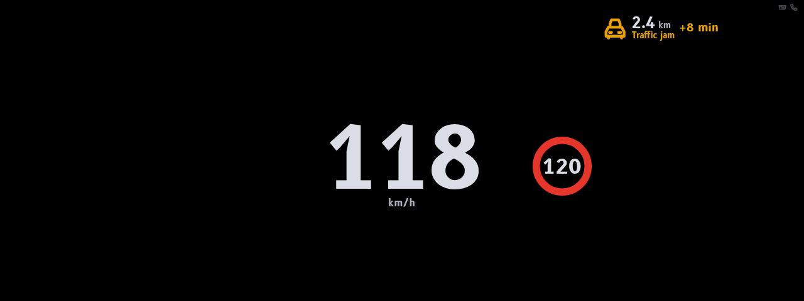
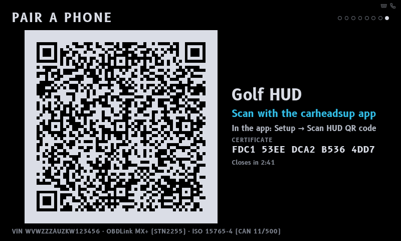
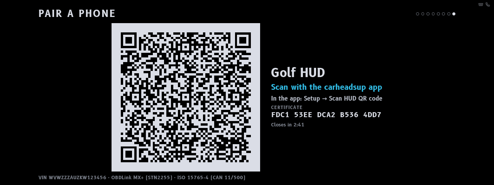
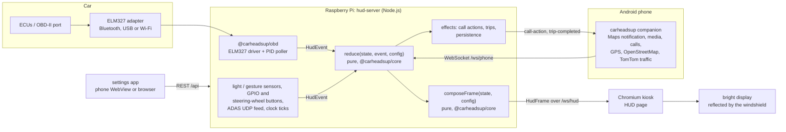

# carheadsup

**A DIY windshield head-up display.** A Raspberry Pi drives a bright little screen lying on the
dashboard; its image reflects off the windshield (or a small combiner glass) into the driver's
view. The Pi reads the car over OBD-II through an ELM327 adapter, gets navigation, calls, music
and messages from an Android companion app, and shows a minimal, context-aware overlay: light on
black, because black pixels are invisible on the glass.


> carheadsup is a hobby project, not a certified automotive product. Read
> [docs/safety.md](docs/safety.md) before you drive with it, and check the laws where you drive.

## Screenshots

The real system running the simulator's demo drive (`npm run sim`), captured unmirrored at
1280×480:

| | |
| --- | --- |
|  City: guidance with lane arrows, gear, economy, speed limit, now playing |  Highway: only speed, limit and the speed camera ahead |
|  Incoming call with accept / decline |  Parked: the diagnostics dashboard with decoded trouble codes |

The HUD view rendered from the sample frames in
[`packages/hud-renderer/src/hud/fixtures.ts`](packages/hud-renderer/src/hud/fixtures.ts), shown
unmirrored. In the car the image is mirrored so that it reads correctly in the reflection.

| | | |
| --- | --- | --- |
|  City: turn arrow, street, ETA, gear, economy, media |  Highway: guidance appears only near the exit |  Roundabout with exit number |
|  Speed turns red above the limit |  Caller ID, accept / decline |  Decoded trouble code |
|  Night palette, dimmed |  Low tyre (custom PIDs) |  Forward-collision warning (ADAS module) |
|  Parked: diagnostics dashboard |  Parked: trouble codes |  Parked: trip page |
|  mph and a US-style limit sign |  Speed camera ahead (OpenStreetMap) |  Sport layout: tachometer, shift light, boost |
|  Blind-spot indicator (ADAS module) |  Coolant appears only when out of range |  Dashboard on a bar display |
|  Parked: service reminders |  Call card on a bar display |  Lane guidance on a bar display |
|  Traffic jam 2.4 km ahead with its delay (TomTom, optional) |  Parked: the pairing QR code the companion scans |  Pairing code on a bar display |

<p>


</p>

The settings app on a phone and the developer console with the live HUD and the simulator
controls; the console also has a gallery of the sample frames
([screenshot](docs/screenshots/dev-console.png)).

## Features

What works, mapped to the original wish list, including where it stops.

### Core driving information (OBD-II)

- **Speed and RPM** from the engine computer; a tachometer bar in the *sport* layout.
- **Gear**: reported by the car where it supports PID `A4`, otherwise inferred from the rpm/speed
  ratio. Gear ratios are learned automatically while you drive (or entered by hand); an inferred
  gear is marked as such. Not shown for CVTs.
- **Coolant temperature and battery voltage only when out of range**: nothing on screen while all
  is well; a readout plus an alert when the engine runs hot or the charging system misbehaves.
- **Check-engine alerts with decoded codes**, e.g. `P0420 – Catalytic converter efficiency`:
  stored, pending and permanent codes, about 4,100 generic codes in the built-in database and a
  range description for manufacturer-specific ones.
- **Live fuel economy and estimated range** from the fuel-rate PID, the mass-air-flow sensor or a
  speed-density estimate (diesels need the fuel-rate PID).

### Navigation from the phone

The [Android companion](companion-android/README.md) reads Google Maps' ongoing navigation
notification and sends it to the HUD.

- **Turn arrow and distance countdown** (dead-reckoned with the car's own speed between phone
  updates), the next street, a "then…" follow-up maneuver, **ETA** and remaining time and distance.
  When the maneuver cannot be classified, Maps' own arrow icon is shown — redrawn by the HUD in
  its own colour, since Maps' colours could be invisible or a bright square on the windshield.
  Google Maps in English and German is understood; the companion's *Status* screen shows how many
  updates it understood, and its capture (*Setup → Debugging*) turns misunderstood ones into
  parser test cases ([how](docs/development.md#how-to-add-a-navigation-language)).
- **Lane guidance** is drawn when the source provides it. Google Maps' notification does not, so
  with Google Maps there are no lane arrows.
- **Speed limit from OpenStreetMap** (looked up by the phone), with the speed turning red once you
  are over it (by more than a configurable tolerance). Vienna-convention or US-style sign.
- **Hazards**: fixed speed, red-light and section-control cameras from OpenStreetMap, and —
  with your own free [TomTom API key](companion-android/README.md#traffic-tomtom), switched on in
  the companion — **traffic ahead**: jams and slowdowns with the expected delay ("+8 min"),
  accidents, road and lane closures, road works, weather and broken-down vehicles up to about
  10 km ahead in the direction of travel, on your side of the road. On the highway the HUD shows
  traffic from 3 km, cameras and other hazards from 1 km. Google Maps does not expose its traffic
  data, and OpenStreetMap has none, hence TomTom.
- **Not supported: navigation from Android Auto.** While the phone projects to the car's screen
  with Android Auto, Maps runs guidance in the projected session, the phone-side notification is
  typically missing or reduced, and no other app can read Android Auto's guidance — so the HUD
  gets little or none. The companion notices the projection and says so on its *Status* screen.
  For guidance on the HUD, navigate with Google Maps on the phone without Android Auto.

### Phone and media

- **Caller ID** with accept / decline by gesture sensor (swipe right / left), GPIO buttons, the
  car's steering-wheel buttons (through the paired phone, or read from the CAN bus or the button
  wire), a keyboard on the kiosk, or the companion app's remote screen.
- **Song and artist** as a toast on track change that fades out after a few seconds.
- **Messages: sender only.** Message text never reaches the HUD (the protocol has no field for it
  and the HUD rejects messages that try); the phone reads the message aloud instead.
- **Pairing by QR code.** Parked, the HUD shows a QR code on its own display — the dashboard's
  last page, or the settings app's *Show pairing code on the HUD* — and the companion scans it:
  pairing code, the HUD's identity and certificate and its address in one go, nothing to type
  and no certificate trusted on first use. A new HUD makes a random pairing code itself.

### Smart and contextual

- **Adaptive clutter** by driving context — *parked*, *stopped*, *city*, *highway* — with
  hysteresis so the layout never flickers. The highway view shows the least.
- **Auto-brightness and night mode** from an I²C light sensor (BH1750, VEML7700, TSL2591) or,
  without one, from the sun's position (phone GPS, a fixed location or the time zone) or the
  clock. Drives the panel backlight — a Linux backlight device, an HDMI monitor over DDC/CI or a
  PWM dimming input — and the page brightness otherwise.
- **Shift light** (bar that fills and flashes near your shift point).
- **Trip logging** with distance, time, fuel and cost; each finished trip is pushed to the phone;
  CSV export from the settings app or `GET /api/trips.csv`.
- **Maintenance reminders** by distance and/or date (oil, tyres, filters, brake fluid, coolant —
  editable).
- **Parked diagnostics dashboard** (at a stop, one press of the page button away): live engine,
  fuel and electrical values, trouble codes with descriptions, the current (or last) trip and
  service status. Codes can be cleared from the settings app, but only when parked with the
  engine off.

### Nice-to-haves

- **Blind-spot and forward-collision visualisation** fed by an external ADAS module (camera or
  radar) over UDP. The HUD only displays what the module detects.
- **Tyre pressures (TPMS)** through manufacturer-specific PIDs configured as custom PIDs.
- **Customisable layouts**: three presets (minimal, standard, sport) or a custom layout — which
  widget goes into which cell of a 3×3 grid and in which driving contexts — edited in the
  settings app, which the companion opens from the phone.

### Limitations

- Bluetooth LE-only OBD adapters (e.g. OBDLink CX) are not supported: the HUD talks to adapters
  over serial (Bluetooth SPP or USB) or TCP (Wi-Fi).
- Google Maps' notification is not an API. Its wording can change with any Maps update; the
  parser understands English and German instructions.
- Speed limits and cameras are only as good as OpenStreetMap where you drive, and need the phone.
- Traffic needs a TomTom API key, mobile data, and sends TomTom the area around and ahead of the
  car. The phone does not know the route, so it reports what lies ahead in the direction of
  travel — including on a road the route is about to leave — and the free plan's 2,500 requests
  a day (the app uses at most 2,000) mean updates every couple of minutes, not live.
- The phone link is encrypted: the companion talks to the HUD over TLS (port 8443) and pins the
  HUD's self-signed certificate when it pairs, and phone and HUD prove the pairing token to each
  other (it never crosses the Wi-Fi) bound to that certificate, so nobody in between can read or
  relay the session. The phone remembers its HUD and sends nothing to any other one; a changed
  certificate stops it until you pair again. Scanning the HUD's pairing QR code takes the
  certificate from the HUD's own display, so the first connection is already authenticated;
  anyone who can see the display while that page is up (parked, at most 3 minutes) can scan the
  code too. Pairing by typing the code in trusts the certificate the first connection sees:
  someone controlling the car's Wi-Fi at that moment cannot get in without the token, but could
  test guesses of a weak one — use a generated code and compare the fingerprint the app shows
  with the settings app. Without a pairing token (only a HUD set up before new HUDs made one, or
  one whose token was removed) nothing is proven: the phone asks you to confirm the HUD, and any
  phone can connect — set one ([details](docs/protocol.md#pairing-by-qr-code)).
- The web pages in a browser on another device (settings app, developer console) use HTTPS on
  port 8443 — plain `http://…:8080` redirects there, and the API refuses other devices over plain
  HTTP, so the API token never crosses the Wi-Fi in clear text. The certificate is the HUD's own:
  each browser warns once, and only comparing its fingerprint with the one the HUD shows tells a
  real HUD from someone posing as it on the Wi-Fi. With TLS switched off (`server.tlsPort` null)
  or `server.allowPlainRemote` on, browsers fall back to plain HTTP and the token is readable on
  the Wi-Fi. Protect the network with WPA2 and set an API token (see
  [docs/architecture.md](docs/architecture.md#security-model)).
- A flat reflection puts the image about a metre ahead of your eyes, not several metres down the
  road like a factory HUD with focusing optics.
- The ADAS feed is plain UDP: only the addresses in `sensors.adasAllowedSenders` are heard, but
  a device on the same network can forge a source address, so the list keeps out mistakes, not a
  determined attacker.
- The Pi has no battery-backed clock (except a Pi 5 with its battery fitted): set one up or give it
  network time, or the clock, trip dates and date-based reminders drift — and without either, the
  HUD cannot tell how long the car was off, so consecutive drives merge into one trip until
  network time arrives ([details](docs/hardware.md#clock)).

### What has been tested, and what has not

Everything below the hardware is tested automatically: the core logic and the server (unit and
integration tests, including whole simulated drives), the OBD driver against an ELM327
emulator, the three web pages in Chromium against the running simulator (Playwright), the
deployment scripts (`deploy/check.sh`), and the companion's protocol module (JVM tests that
share test vectors with the server). What has **not** been verified:

- **Real cars and adapters.** The OBD code has only met the built-in ELM327 emulator and the
  vehicle simulator, not a real ELM327 clone, OBDLink or car; adapter quirks, slow ECUs and
  manufacturer PIDs may need work.
- **Raspberry Pi peripherals.** The GPIO buttons, I²C light and gesture sensors, the
  steering-wheel inputs (CAN HAT with `candump`, ADS1115 ladder), backlight control, the kiosk on
  a real display, the hotspot, mDNS on the car's Wi-Fi and the ignition power-down are covered by
  tests with fakes and by script linting, not on a Pi or in a car.
- **The Android app (`:app`).** It could not be compiled here (no Android SDK); only its
  `:protocol` module is built and tested, and the app code was type-checked against stubs. The
  notification parsing, media, calls, discovery, pairing screens, the QR scanner (CameraX), file
  export and the TLS pinning in OkHttp and the settings WebView have not run on a phone (the
  pinning trust manager itself is tested in `:protocol` with real TLS handshakes against
  certificates made by the HUD, and the QR decoder with the very code the HUD draws, plain,
  mirrored and inverted — but not with a camera pointed at a real panel).
- **TomTom's live service.** The traffic client is tested against sample answers modelled on
  TomTom's documented Incident Details format, not against the real API.
- **An ADAS module.** The UDP feed is tested with synthetic datagrams only.

## Quick start (no car needed)

Requires Node.js 22.18 or newer.

```sh
git clone https://github.com/Platteration/carheadsup
cd carheadsup
npm install
npm run sim
```

`npm run sim` builds the web pages on first use and starts the server with a simulated car
(an emulated ELM327 adapter running a scripted drive), a simulated phone (navigation, a call,
music, a message, speed limits, a camera and a traffic jam) and simulated sensors. The demo drive
loops about every 5 minutes: warm-up at a standstill, city driving with guidance, a red light with
an incoming call, an on-ramp, highway with a speed camera and then a traffic jam reported beyond
the exit, the exit, arriving (a message comes in),
and finally standing with the engine off, where the simulated phone's remote opens the
diagnostics dashboard (the HUD alone waits 3 minutes with the engine off, so that start-stop at
a red light never opens it); it closes as the car drives off on the next loop. Then open:

- <http://localhost:8080/> — the HUD itself. It is **mirrored** for the windshield; add
  [`?preview=1`](http://localhost:8080/?preview=1) to see it the right way round.
- <http://localhost:8080/dev> — the developer console: live HUD preview, simulator controls
  (throttle, brake, faults, phone events such as a call or a traffic jam, ADAS, light level),
  input buttons and a gallery of sample frames.
- <http://localhost:8080/settings> — the settings app, as the phone shows it. While the simulated
  car is parked (at the start, or in the developer console's *manual* mode with the engine off),
  *Phone → Show pairing code on the HUD* puts the pairing QR code on the HUD, for the companion
  to scan when the phone is on the same network.

These addresses are for the machine running the simulator. From another device, open
`https://<its address>:8443/dev` (plain `http://…:8080` redirects there) and accept the browser's
warning about the HUD's self-signed certificate — or switch on *Server → Also serve other devices
over plain http* for development.

Simulated drives use their own data directory (`$XDG_DATA_HOME/carheadsup/sim`, by default
`~/.local/share/carheadsup/sim`), so they never mix with real trips. In the developer console
you can take over from the script (*manual* mode) or trigger phone and ADAS events at any time.

### Without a server: the drive simulator

```sh
npm run build:demo
```

builds `packages/hud-renderer/dist-demo/index.html`, one self-contained page (under 1 MB) that
runs the whole HUD in the browser and loads nothing from anywhere. It runs the server's engine
and simulation (the same scripted drive and simulated phone as above), the core's rules and the
real HUD view, with controls for the car, the phone, faults, light, driver assistance, units and
layout. Open it from disk or put it on any static host. `dist-demo/artifact.html` is the same
page without the document skeleton, for hosts that supply their own.

## Architecture



Every input becomes a `HudEvent`. A pure reducer folds events into the HUD state; a pure composer
turns the state into a `HudFrame` — the complete, display-ready description of what to draw, in
the driver's units — which the server pushes to the kiosk page 15 times a second. Because the
core has no I/O and no clock of its own, whole drives can be replayed in tests. Details in
[docs/architecture.md](docs/architecture.md).

## Repository layout

| Path | What | Runs on |
| --- | --- | --- |
| [`packages/core`](packages/core) | Pure domain logic and all shared types (the contract): reducer, composer, alerts, contexts, units, fuel and gear estimation, trips, maintenance, DTC database, config schema, protocol validation | browser + Node.js |
| [`packages/obd`](packages/obd) | ELM327 driver, serial/TCP transports, PID poller, connection service; ELM327 emulator and vehicle simulator | Node.js |
| [`packages/hud-server`](packages/hud-server) | The on-car service: wires OBD, phone link, sensors and the engine; REST API, WebSockets, static pages, persistence, mDNS | Node.js |
| [`packages/hud-renderer`](packages/hud-renderer) | Preact pages: projected HUD (`/`), settings app (`/settings`), developer console (`/dev`) | browser |
| [`companion-android`](companion-android) | Kotlin companion app; its `:protocol` module is plain JVM and testable without the Android SDK | Android |
| [`e2e`](e2e) | Browser end-to-end tests (Playwright) of the HUD page, settings app and developer console against the simulator | Node.js + Chromium |
| [`deploy`](deploy) | Raspberry Pi installer and uninstaller, systemd units, kiosk launcher, hotspot helper, Avahi/PAM/udev files, `check.sh` lint and tests | Raspberry Pi OS |
| [`docs`](docs) | The documentation below and the screenshots | — |

## Documentation

- [Architecture](docs/architecture.md) — packages, data flow, staleness, contexts, alerts,
  persistence, security, performance
- [Hardware](docs/hardware.md) — reference build, display and optics, OBD adapters, power, sensors,
  wiring, bill of materials
- [Installing on a Raspberry Pi](docs/install-raspberry-pi.md) — step by step, systemd, kiosk,
  hotspot, updating, troubleshooting
- [Configuration](docs/configuration.md) — every option, layouts, custom PIDs, command line and
  environment
- [Protocols and API](docs/protocol.md) — phone WebSocket, renderer WebSocket, ADAS UDP, REST, mDNS
- [OBD-II](docs/obd.md) — supported PIDs, polling, adapters, trouble codes, custom PIDs
- [Development](docs/development.md) — workflow, tests, screenshots, adding widgets, codes and
  navigation languages
- [Safety and legal notes](docs/safety.md)
- [Android companion](companion-android/README.md)
