# carheadsup

**A DIY windshield head-up display.** A Raspberry Pi drives a bright little screen lying on the
dashboard; its image reflects off the windshield (or a small combiner glass) into the driver's
view. The Pi reads the car over OBD-II through an ELM327 adapter, gets navigation, calls, music
and messages from an Android companion app, and shows a minimal, context-aware overlay: light on
black, because black pixels are invisible on the glass.

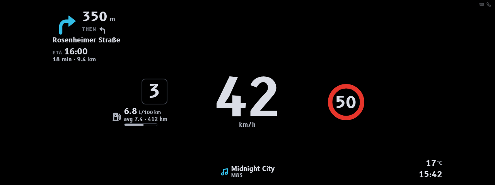

> carheadsup is a hobby project, not a certified automotive product. Read
> [docs/safety.md](docs/safety.md) before you drive with it, and check the laws where you drive.

## Screenshots

The real system running the simulator's demo drive (`npm run sim`), captured unmirrored at
1280×480:

| | |
| --- | --- |
| 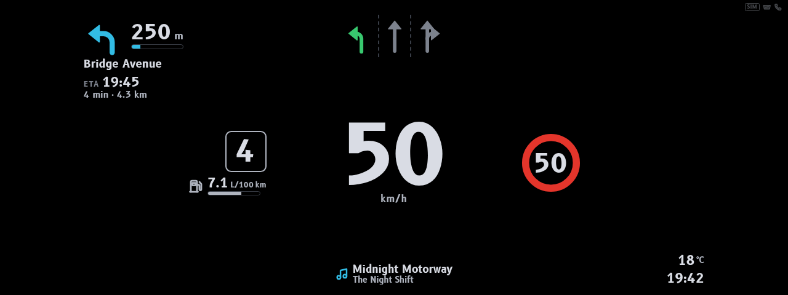 City: guidance with lane arrows, gear, economy, speed limit, now playing |  Highway: only speed, limit and the speed camera ahead |
| 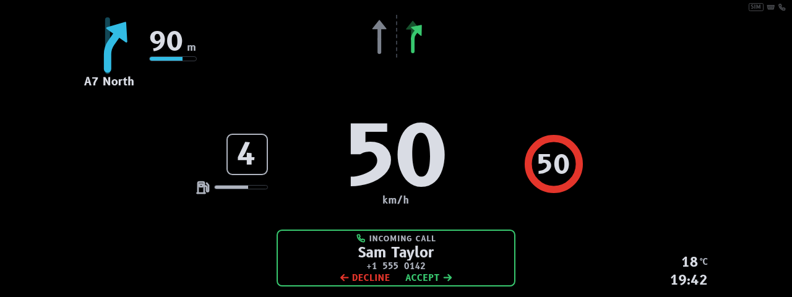 Incoming call with accept / decline | 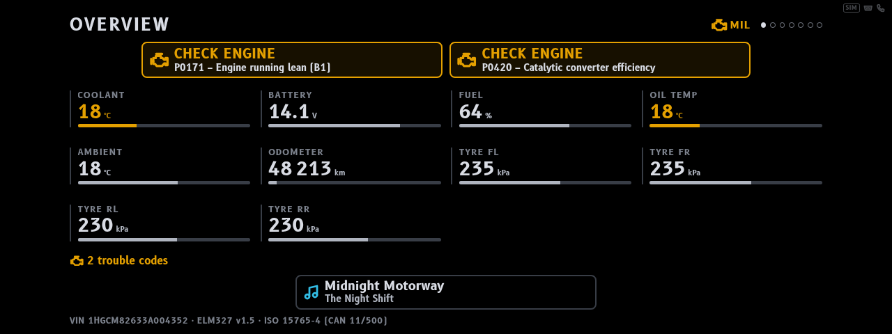 Parked: the diagnostics dashboard with decoded trouble codes |

The HUD view rendered from the sample frames in
[`packages/hud-renderer/src/hud/fixtures.ts`](packages/hud-renderer/src/hud/fixtures.ts), shown
unmirrored. In the car the image is mirrored so that it reads correctly in the reflection.

| | | |
| --- | --- | --- |
| 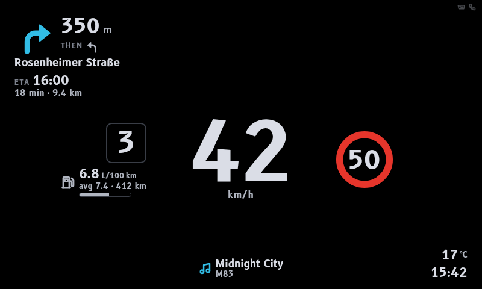 City: turn arrow, street, ETA, gear, economy, media | 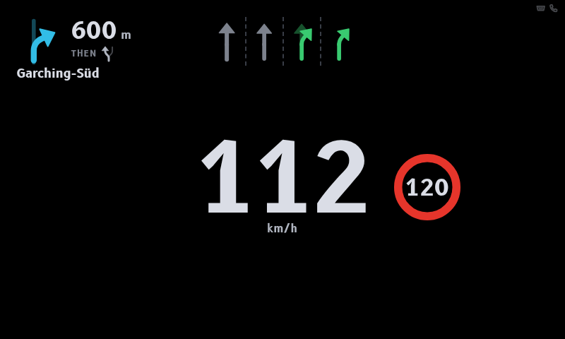 Highway: guidance appears only near the exit | 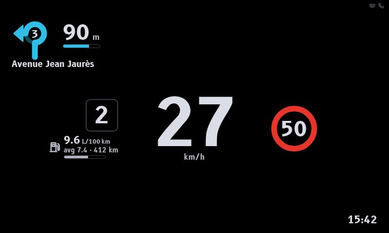 Roundabout with exit number |
| 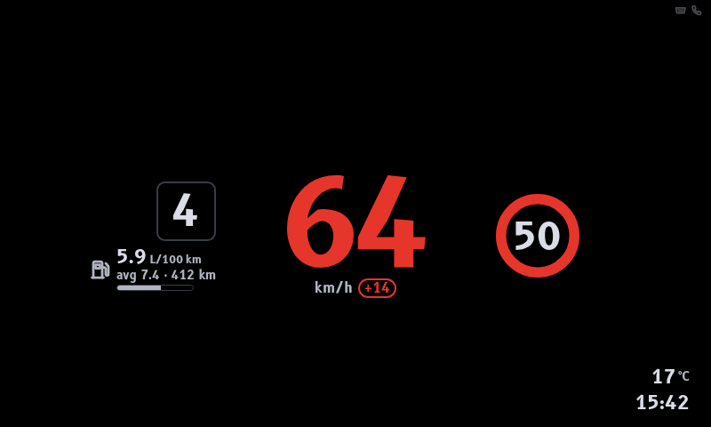 Speed turns red above the limit | 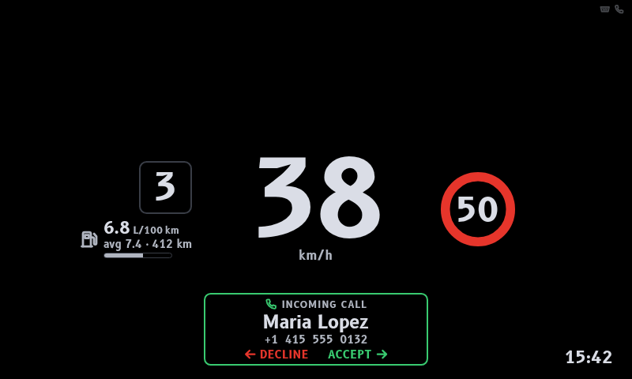 Caller ID, accept / decline | 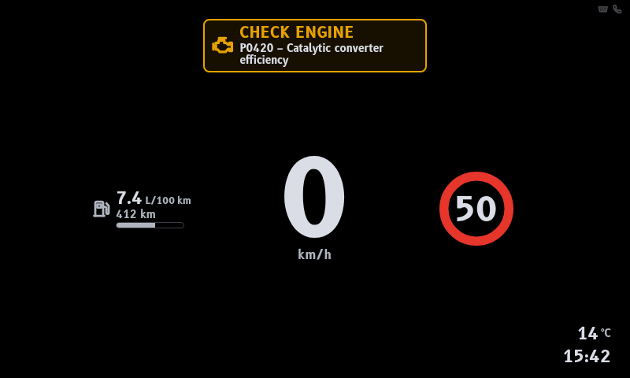 Decoded trouble code |
| 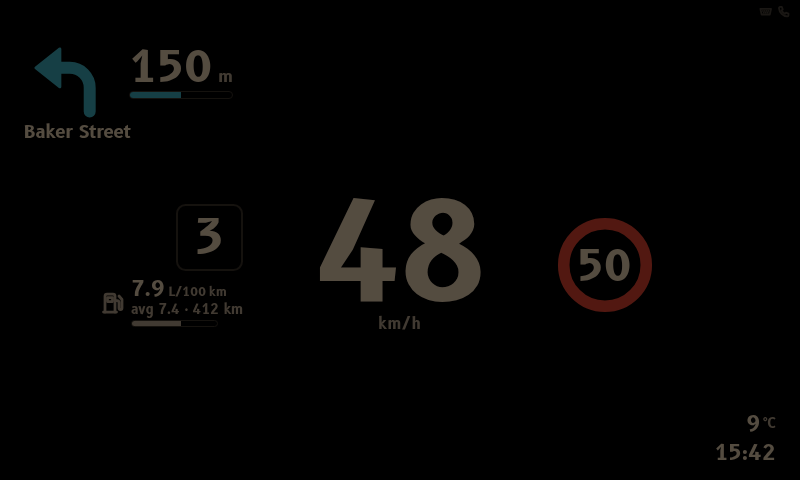 Night palette, dimmed | 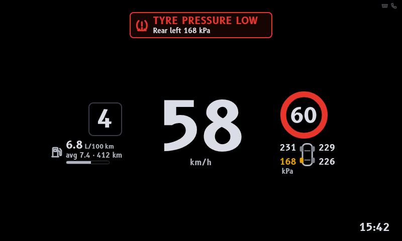 Low tyre (custom PIDs) | 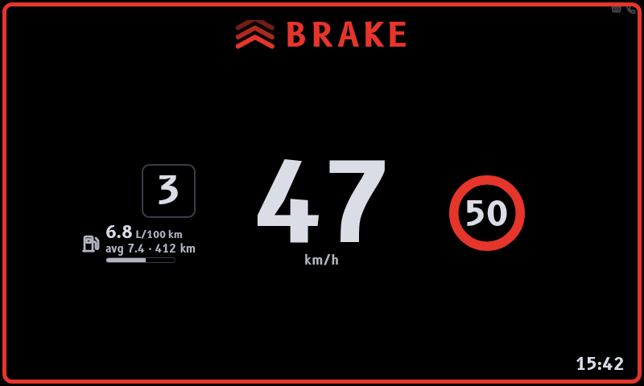 Forward-collision warning (ADAS module) |
| 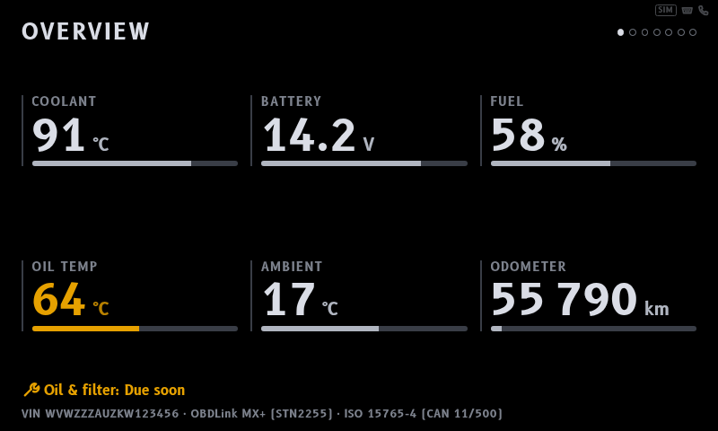 Parked: diagnostics dashboard | 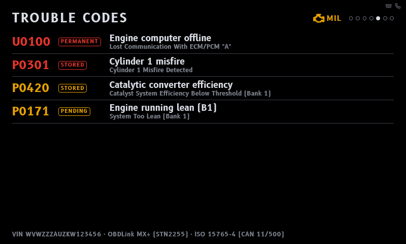 Parked: trouble codes | 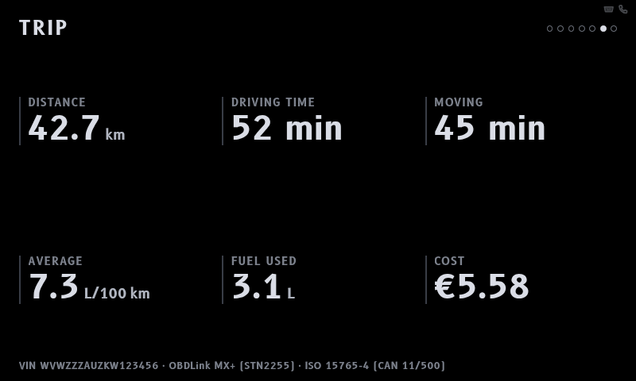 Parked: trip page |
| 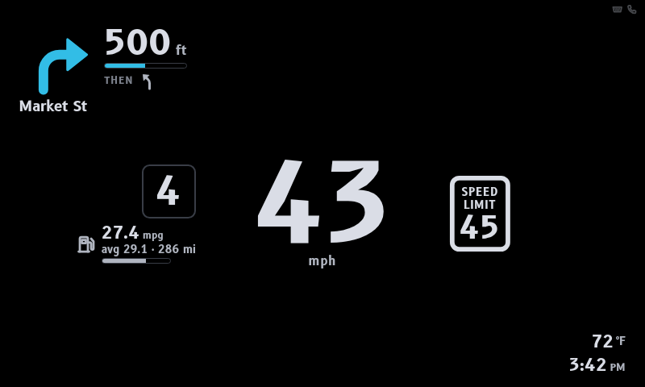 mph and a US-style limit sign |  Speed camera ahead (OpenStreetMap) | 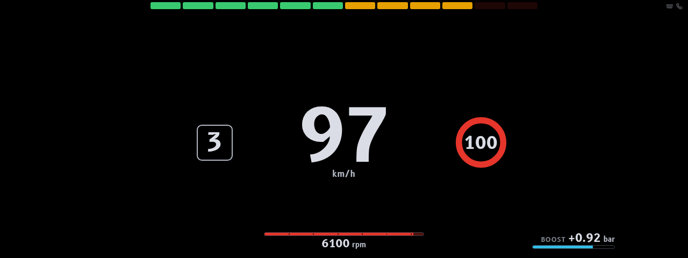 Sport layout: tachometer, shift light, boost |
| 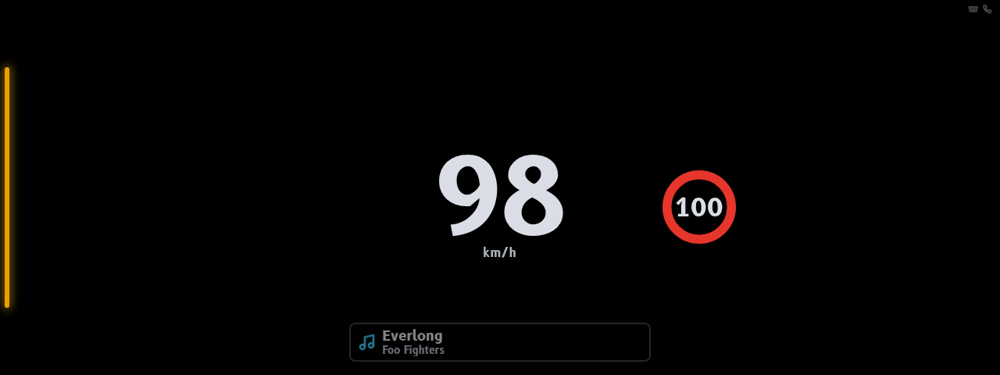 Blind-spot indicator (ADAS module) | 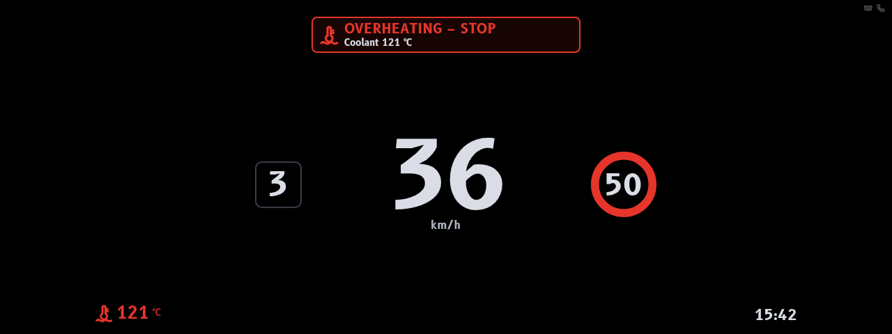 Coolant appears only when out of range | 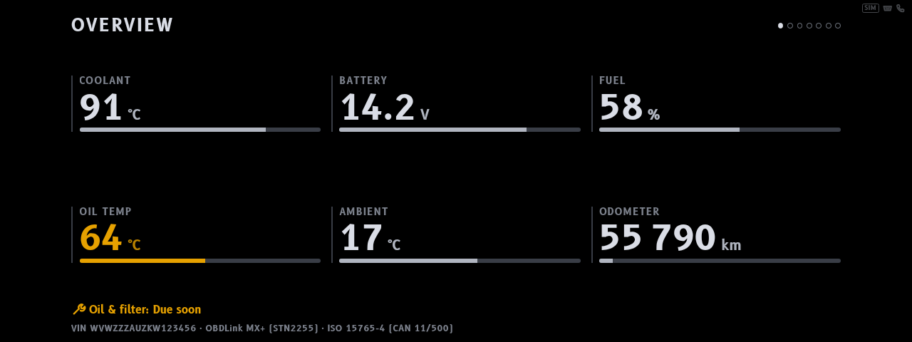 Dashboard on a bar display |
| 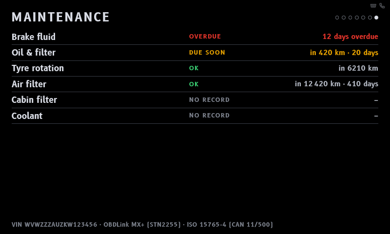 Parked: service reminders | 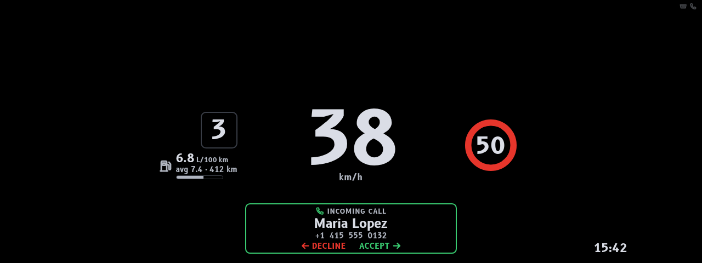 Call card on a bar display | 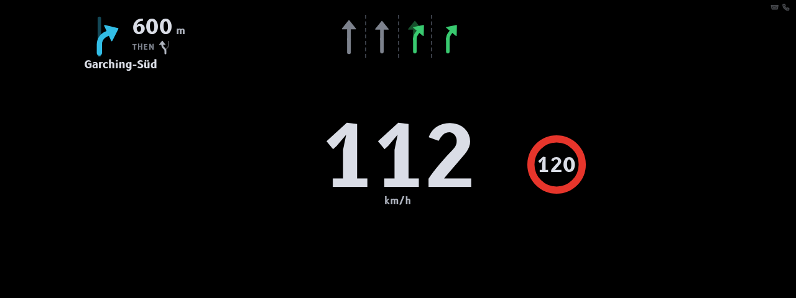 Lane guidance on a bar display |

<p>
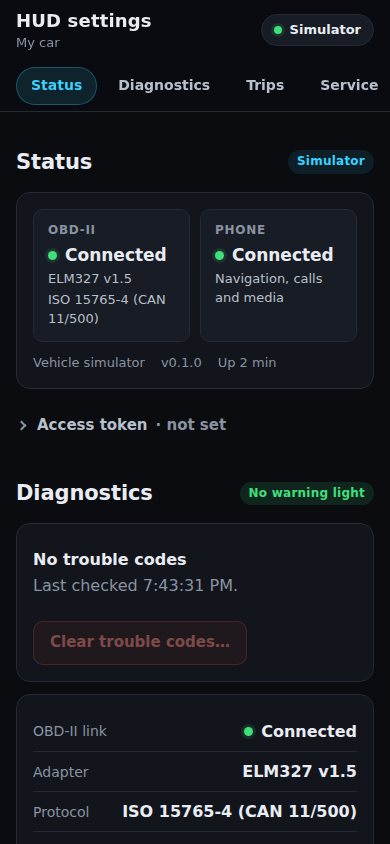
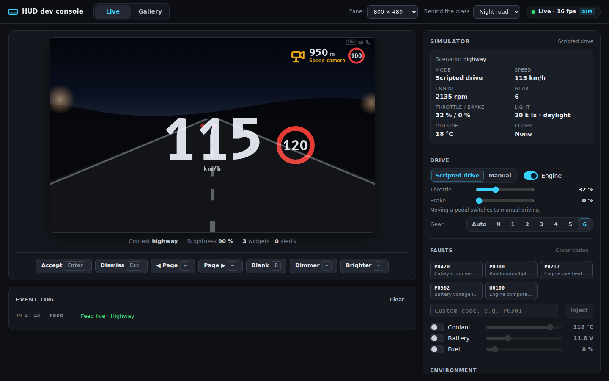
</p>

The settings app on a phone and the developer console with the live HUD and the simulator
controls; the console also has a gallery of the sample frames
([screenshot](docs/screenshots/dev-console.png)).

## Features

What works, mapped to the original wish list, including where it stops.

### Core driving information (OBD-II)

- **Speed and RPM** from the engine computer; a tachometer bar in the *sport* layout.
- **Gear**: reported by the car where it supports PID `A4`, otherwise inferred from the rpm/speed
  ratio. Gear ratios are learned automatically while you drive (or entered by hand); an inferred
  gear is marked as such. Not shown for CVTs.
- **Coolant temperature and battery voltage only when out of range**: nothing on screen while all
  is well; a readout plus an alert when the engine runs hot or the charging system misbehaves.
- **Check-engine alerts with decoded codes**, e.g. `P0420 – Catalytic converter efficiency`:
  stored, pending and permanent codes, about 4,100 generic codes in the built-in database and a
  range description for manufacturer-specific ones.
- **Live fuel economy and estimated range** from the fuel-rate PID, the mass-air-flow sensor or a
  speed-density estimate (diesels need the fuel-rate PID).

### Navigation from the phone

The [Android companion](companion-android/README.md) reads Google Maps' ongoing navigation
notification and sends it to the HUD.

- **Turn arrow and distance countdown** (dead-reckoned with the car's own speed between phone
  updates), the next street, a "then…" follow-up maneuver, **ETA** and remaining time and distance.
  When the maneuver cannot be classified, Maps' own arrow icon is shown.
- **Lane guidance** is drawn when the source provides it. Google Maps' notification does not, so
  with Google Maps there are no lane arrows.
- **Speed limit from OpenStreetMap** (looked up by the phone), with the speed turning red once you
  are over it (by more than a configurable tolerance). Vienna-convention or US-style sign.
- **Hazards**: fixed speed, red-light and section-control cameras from OpenStreetMap. Traffic
  slowdowns are supported by the HUD but only appear if a source provides them; the companion has
  none (Google Maps does not expose its traffic data).
- **Android Auto caveat**: while the phone projects to the car's screen with Android Auto, Maps
  runs guidance in the projected session and the phone-side notification is typically missing or
  reduced, so the HUD gets little or no guidance. Run Maps on the phone instead.

### Phone and media

- **Caller ID** with accept / decline by gesture sensor (swipe right / left), GPIO buttons, a
  keyboard on the kiosk, or the companion app's remote screen.
- **Song and artist** as a toast on track change that fades out after a few seconds.
- **Messages: sender only.** Message text never reaches the HUD (the protocol has no field for it
  and the HUD rejects messages that try); the phone reads the message aloud instead.

### Smart and contextual

- **Adaptive clutter** by driving context — *parked*, *stopped*, *city*, *highway* — with
  hysteresis so the layout never flickers. The highway view shows the least.
- **Auto-brightness and night mode** from an I²C light sensor (BH1750, VEML7700, TSL2591) or,
  without one, from the sun's position (phone GPS or a fixed location). Drives the panel backlight
  when there is one, and the page brightness in any case.
- **Shift light** (bar that fills and flashes near your shift point).
- **Trip logging** with distance, time, fuel and cost; each finished trip is pushed to the phone;
  CSV export from the settings app or `GET /api/trips.csv`.
- **Maintenance reminders** by distance and/or date (oil, tyres, filters, brake fluid, coolant —
  editable).
- **Parked diagnostics dashboard**: live engine, fuel and electrical values, trouble codes with
  descriptions, the current (or last) trip and service status. Codes can be cleared from the
  settings app, but only when parked with the engine off.

### Nice-to-haves

- **Blind-spot and forward-collision visualisation** fed by an external ADAS module (camera or
  radar) over UDP. The HUD only displays what the module detects.
- **Tyre pressures (TPMS)** through manufacturer-specific PIDs configured as custom PIDs.
- **Customisable layouts**: three presets (minimal, standard, sport) or a custom layout — which
  widget goes into which cell of a 3×3 grid and in which driving contexts — edited in the
  settings app, which the companion opens from the phone.

### Limitations

- Bluetooth LE-only OBD adapters (e.g. OBDLink CX) are not supported: the HUD talks to adapters
  over serial (Bluetooth SPP or USB) or TCP (Wi-Fi).
- Google Maps' notification is not an API. Its wording can change with any Maps update; the
  parser understands English and German instructions.
- Speed limits and cameras are only as good as OpenStreetMap where you drive, and need the phone.
- The API is plain HTTP on the car's network; protect it with WPA2 on the Wi-Fi and the API and
  pairing tokens (see [docs/architecture.md](docs/architecture.md#security-model)).
- The companion app does not yet verify that the HUD it finds is yours: with automatic discovery
  it connects to whatever advertises a HUD on its current Wi-Fi, and hands it its tokens,
  position and call data. Use the car's own Wi-Fi, or a manual address on shared networks
  ([details](companion-android/README.md#privacy)).
- A flat reflection puts the image about a metre ahead of your eyes, not several metres down the
  road like a factory HUD with focusing optics.
- The Pi has no battery-backed clock (except a Pi 5 with its battery fitted): set one up or give it
  network time, or the clock, trip dates and date-based reminders drift.

## Quick start (no car needed)

Requires Node.js 22.18 or newer.

```sh
git clone https://github.com/Platteration/carheadsup
cd carheadsup
npm install
npm run sim
```

`npm run sim` builds the web pages on first use and starts the server with a simulated car
(an emulated ELM327 adapter running a scripted drive), a simulated phone (navigation, a call,
music, a message, speed limits and a camera) and simulated sensors. The demo drive loops about
every 7½ minutes: warm-up at a standstill, city driving with guidance, a red light with an
incoming call, an on-ramp, highway with a speed camera, the exit, arriving (a message comes in),
and finally standing with the engine off — after 3 minutes (so that start-stop at a red light
never opens it) the parked diagnostics dashboard shows for 15 s, then it starts over. Then open:

- <http://localhost:8080/> — the HUD itself. It is **mirrored** for the windshield; add
  [`?preview=1`](http://localhost:8080/?preview=1) to see it the right way round.
- <http://localhost:8080/dev> — the developer console: live HUD preview, simulator controls
  (throttle, brake, faults, phone events, ADAS, light level), input buttons and a gallery of
  sample frames.
- <http://localhost:8080/settings> — the settings app, as the phone shows it.

Simulated drives use their own data directory (`$XDG_DATA_HOME/carheadsup/sim`, by default
`~/.local/share/carheadsup/sim`), so they never mix with real trips. In the developer console
you can take over from the script (*manual* mode) or trigger phone and ADAS events at any time.

## Architecture

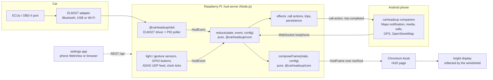
```mermaid
flowchart LR
  subgraph car["Car"]
    ecu["ECUs / OBD-II port"] --> elm["ELM327 adapter<br/>Bluetooth, USB or Wi-Fi"]
  end
  subgraph phone["Android phone"]
    app["carheadsup companion<br/>Maps notification, media, calls,<br/>GPS, OpenStreetMap"]
  end
  subgraph pi["Raspberry Pi: hud-server (Node.js)"]
    obd["@carheadsup/obd<br/>ELM327 driver + PID poller"]
    inputs["light / gesture sensors, GPIO buttons,<br/>ADAS UDP feed, clock ticks"]
    reduce["reduce(state, event, config)<br/>pure, @carheadsup/core"]
    compose["composeFrame(state, config)<br/>pure, @carheadsup/core"]
    effects["effects: call actions, trips,<br/>persistence"]
  end
  elm --> obd
  obd -->|"HudEvent"| reduce
  inputs -->|"HudEvent"| reduce
  app -->|"WebSocket /ws/phone"| reduce
  reduce --> compose
  reduce --> effects
  effects -->|"call-action, trip-completed"| app
  compose -->|"HudFrame over /ws/hud"| kiosk["Chromium kiosk<br/>HUD page"]
  kiosk --> display["bright display<br/>reflected by the windshield"]
  settings["settings app<br/>phone WebView or browser"] -->|"REST /api"| pi
```

Every input becomes a `HudEvent`. A pure reducer folds events into the HUD state; a pure composer
turns the state into a `HudFrame` — the complete, display-ready description of what to draw, in
the driver's units — which the server pushes to the kiosk page 15 times a second. Because the
core has no I/O and no clock of its own, whole drives can be replayed in tests. Details in
[docs/architecture.md](docs/architecture.md).

## Repository layout

| Path | What | Runs on |
| --- | --- | --- |
| [`packages/core`](packages/core) | Pure domain logic and all shared types (the contract): reducer, composer, alerts, contexts, units, fuel and gear estimation, trips, maintenance, DTC database, config schema, protocol validation | browser + Node.js |
| [`packages/obd`](packages/obd) | ELM327 driver, serial/TCP transports, PID poller, connection service; ELM327 emulator and vehicle simulator | Node.js |
| [`packages/hud-server`](packages/hud-server) | The on-car service: wires OBD, phone link, sensors and the engine; REST API, WebSockets, static pages, persistence, mDNS | Node.js |
| [`packages/hud-renderer`](packages/hud-renderer) | Preact pages: projected HUD (`/`), settings app (`/settings`), developer console (`/dev`) | browser |
| [`companion-android`](companion-android) | Kotlin companion app; its `:protocol` module is plain JVM and testable without the Android SDK | Android |
| [`e2e`](e2e) | Browser end-to-end tests (Playwright) of the HUD page, settings app and developer console against the simulator | Node.js + Chromium |
| [`deploy`](deploy) | Raspberry Pi installer and uninstaller, systemd units, kiosk launcher, hotspot helper, Avahi/PAM/udev files, `check.sh` lint and tests | Raspberry Pi OS |
| [`docs`](docs) | The documentation below and the screenshots | — |

## Documentation

- [Architecture](docs/architecture.md) — packages, data flow, staleness, contexts, alerts,
  persistence, security, performance
- [Hardware](docs/hardware.md) — reference build, display and optics, OBD adapters, power, sensors,
  wiring, bill of materials
- [Installing on a Raspberry Pi](docs/install-raspberry-pi.md) — step by step, systemd, kiosk,
  hotspot, updating, troubleshooting
- [Configuration](docs/configuration.md) — every option, layouts, custom PIDs, command line and
  environment
- [Protocols and API](docs/protocol.md) — phone WebSocket, renderer WebSocket, ADAS UDP, REST, mDNS
- [OBD-II](docs/obd.md) — supported PIDs, polling, adapters, trouble codes, custom PIDs
- [Development](docs/development.md) — workflow, tests, screenshots, adding widgets, codes and
  navigation languages
- [Safety and legal notes](docs/safety.md)
- [Android companion](companion-android/README.md)
