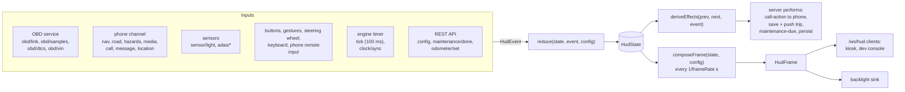

# Architecture

carheadsup is a small event-driven system. Everything the HUD knows arrives as an event; a pure
reducer turns events into state; a pure composer turns state into a frame that says exactly what
to draw; a browser page draws it. This document explains the pieces and the rules that hold them
together. The type definitions in [`packages/core/src/types`](../packages/core/src/types) are the
contract between all of them.

- [Packages](#packages)
- [Data flow](#data-flow)
- [Purity and replayability](#purity-and-replayability)
- [Engine time and the wall clock](#engine-time-and-the-wall-clock)
- [Staleness safety](#staleness-safety)
- [Driving contexts and adaptive clutter](#driving-contexts-and-adaptive-clutter)
- [Alerts](#alerts)
- [Driver input](#driver-input)
- [The server](#the-server)
- [Persistence](#persistence)
- [Security model](#security-model)
- [Performance](#performance)

## Packages

| Package | Role | Key modules |
| --- | --- | --- |
| `@carheadsup/core` | All domain logic and the shared types. No I/O, no clock, no randomness; runs in Node.js and the browser. | `state/reducer.ts`, `compose/compose.ts`, `alerts/`, `display/` (context, brightness, sun, shift light), `vehicle/` (fuel, gear), `trip/`, `maintenance/`, `obd/` (PIDs, formulas, DTC database), `config/` (defaults, presets, schema), `protocol/` (message validation, phone authentication, pairing URI) |
| `@carheadsup/obd` | Talks to the car. | `transport.ts` (serial, TCP), `elm327.ts` (driver), `poller.ts` (PID scheduling), `service.ts` (connect / reconnect loop, events), `sim/` (ELM327 emulator and vehicle simulator) |
| `@carheadsup/hud-server` | The on-car service that wires everything together. | `app.ts` (composition), `engine.ts` (reducer loop, effects, frame timer), `http/` (REST API, static files, auth), `ws/` (phone and renderer sockets), `tls/` (the HUD's self-signed certificate: DER encoder, X.509 builder, `tls.pem`), `phone/auth.ts` (the phone proofs), `sensors/` (light, gesture, GPIO buttons, steering-wheel buttons over CAN or an ADC, ADAS UDP), `outputs/backlight.ts`, `store/` (config, state, trips), `discovery/mdns.ts`, `sim/` |
| `@carheadsup/hud-renderer` | The three web pages. | `hud/` (projected HUD), `settings/` (settings app), `dev/` (developer console), `common/` (WebSocket feed, REST client, staleness) |
| `companion-android` | The phone app. `:protocol` mirrors the TypeScript contract in Kotlin; `:app` is the Android UI and services. | see [its README](../companion-android/README.md) |

Dependencies point one way: `core` ← `obd` ← `hud-server`, and `core` ← `hud-renderer`. The
renderer never talks to `obd` or the server's internals — only to the server's WebSocket and REST
API.

## Data flow

1. **Inputs become events.** The OBD service emits one `obd/samples` event per polling cycle with
   all values in canonical units (km/h, °C, kPa, V, L/h …). The phone channel validates each
   message and translates it (`phone/translate.ts`). Sensors, buttons and the ADAS feed emit their
   own events; the engine emits a `tick` every 100 ms and a `clock/sync` when the system clock
   moves ([below](#engine-time-and-the-wall-clock)); config changes arrive as a `config` event.
2. **The engine stamps and reduces.** `HudEngine.dispatch` replaces `event.at` with the engine
   time — monotonic, see [Engine time and the wall clock](#engine-time-and-the-wall-clock) — and
   runs `reduce(state, event, config)`. Events dispatched while an effect is being handled are
   queued and processed in order.
3. **Effects.** `deriveEffects(prev, next, event, config)` decides what should happen outside the
   core: tell the phone to accept or decline a call, save and push a finished trip, push due
   maintenance items, persist the state. The server performs them; the core never does I/O.
4. **Frames.** On its own timer (`server.frameRate`, 15 fps by default) the engine runs
   `composeFrame(state, config)` and publishes the `HudFrame`: visible widgets with their zones,
   alerts, toast, call card, shift light, blind-spot and collision state, the diagnostics
   dashboard and the theme (night, brightness), all converted to the driver's units and rounded.
   The renderer does no business logic and no unit conversion; it draws the frame.

The frame is composed per timer tick rather than per event, so a burst of OBD samples costs one
frame, and the frame rate is independent of how often the car answers.

## Purity and replayability

`packages/core` follows strict rules (see [CLAUDE.md](../CLAUDE.md)):

- no `Date.now()`, `Math.random()`, timers, network, filesystem or `console`;
- time comes only from event timestamps (`event.at`, copied to `state.now`), plus the
  wall-clock offset of the latest `clock/sync` event;
- state is plain JSON-serialisable data, and functions return new objects.

Same events in, same frames out. Tests use this to replay whole drives:
[`packages/core/test/scenarios/drive.test.ts`](../packages/core/test/scenarios/drive.test.ts)
replays one continuous drive — cold start, city with navigation, highway, speeding, an
overheating engine, a call at a stop, parking, the dashboard, the finished trip — through the
real reducer, effects and composer and checks the frames and effects along the way, and
`random-events.test.ts` feeds long seeded random event streams to the reducer and checks that it
never throws or mutates its input and that every frame is well-formed. The simulator exercises
the same code paths as a real car: it sits behind an emulated ELM327 adapter and a simulated
phone that sends real protocol messages.

## Engine time and the wall clock

The system clock of a Pi can be stepped by network time: by hours or days on a Pi without a
real-time clock, which boots with the time `fake-hwclock` saved and syncs once the phone's
hotspot is up — often mid-drive — and backwards on one whose clock ran fast. If the core measured
time with that clock, a forward step would expire the phone's route, the speed limit and every
sample at once and split the trip in progress, and a backward step would keep stale values on
screen as if they were live.

So there are two clocks:

- **Engine time** (`event.at`, `state.now` and every timestamp kept in `HudState`) starts at the
  system clock when the server starts and from then on counts elapsed time on a monotonic clock
  (`EngineClock`, `hud-server/src/clock.ts`). It never steps, never goes backwards and never
  stands still. Everything relative uses it: staleness, toasts, dwell and parking timers, alert
  persistence, call timers, trip durations and trip ends, and `HudFrame.at` (the renderer's
  "frames keep coming" check).
- **The wall clock** reaches the core as an offset: the engine dispatches
  `{ type: 'clock/sync', wallOffsetMs, trusted, at }` (wall clock − engine time) on start and
  before the next event once the offset has moved by more than 2 s or the trust changed, and logs
  the step. The wall clock is the system clock unless the server knows better (`WallClock`, same
  file): without network time it follows the authenticated phone's clock (`hello.time`,
  `ping.time`, [details](protocol.md#the-huds-clock)), and a start whose system clock reads
  earlier than the time the HUD last saved (`state.json`'s `lastWallMs`) counts on from that
  saved time — a Pi without a real-time clock under a read-only root restores the same time at
  every boot. Such a clock is only a lower bound: `state.clock.trusted` is false until the phone or
  network time confirms it, and meanwhile the clock widget is hidden (and the ETA's remaining
  minutes come only from the phone's own count). A step of the system
  clock while the server follows the phone or the saved time (network time setting it before the
  server notices) is absorbed rather than added to the correction. The reducer keeps
  it in `state.clock` and converts (`toWallTime`, `wallNow`) only where the absolute time
  matters: the clock widget; the sun (night mode); service records and due dates; the ETA's
  remaining minutes (the phone's ETA is wall-clock time); trip records — start, end and id, so
  the trip log, its CSV export and the phone get wall-clock times; the trip in progress as saved
  in `state.json`; and the times in REST responses (`/api/diagnostics` also carries the HUD's
  `now`, so the settings app ages samples on the HUD's clock, whatever the phone's says). A sync
  re-derives maintenance status and night mode at once.

A trip that network time corrects mid-drive therefore goes on, and its record carries the
corrected start time. The trip in progress is saved with wall-clock times, since engine time
starts afresh with every start, and compared with the new start's clock: it is completed after
a long break and continued after a short one. One saved *later* than the new start's clock —
an unclean power cut on a Pi without a real-time clock, which then boots with an older saved
time — is completed at the first update, since the length of the break is unknown. The start's
clock can also be behind without showing it: such a Pi boots with the time `fake-hwclock` saved
at shutdown, so every break looks short and the trip is continued. The core therefore keeps the
trip as restored, and what was driven since the start as a trip of its own
(`TripState.resumed`), until the trip ends: if a `clock/sync` then shows that the break was long
after all, the trip from before the restart is completed with its saved times and today's drive
goes on as a new trip (`reconcileResumedTrip`). A start with an untrusted clock (see above)
cannot measure the break at all, and most restarts are an ignition cycle: the trip is continued
only provisionally, and unless a trusted `clock/sync` within 3 minutes (`RESUME_CONFIRM_MS`)
shows a short break, it is split then all the same. A service recorded while the clock is
untrusted is dated with the lower bound and dated again once the real time arrives
(`MaintenanceState.undated`); after a restart the lower bound stays, so the reminder comes early
rather than late.

## Staleness safety

**A missing value is better than a frozen one.** Every signal sample carries the time it was
received, and every consumer reads it through `freshValue()` (`core/src/staleness.ts`) or the
selectors built on it. Samples older than their limit count as absent: the widget disappears,
the alert rule stops firing, the fuel and trip integrators stop integrating.

| Signal(s) | Stale after |
| --- | --- |
| `speed`, `rpm`, `throttle`, `relativeThrottle`, `acceleratorPedal` | 2 s |
| `engineLoad`, `maf`, `map`, `fuelRate`, `transmissionGear` | 3 s |
| `batteryVoltage`, `controlModuleVoltage` | 15 s |
| `fuelLevel`, `odometer`, `ambientTemp`, tyre pressures | 120 s |
| everything else (temperatures, trims, pressures …) | 10 s |

Other data has its own lifetime:

| Data | Rule |
| --- | --- |
| The whole HUD | The kiosk page blanks everything but a small "no signal" dot when the frame time has not advanced for 1 s (two frame intervals at a frame rate below 2, at most 2.5 s) or the socket is closed; after (re)connecting it waits for a second, newer frame, so a server's cached frame is never taken for live (`hud-renderer/src/common/staleness.ts`). |
| Blind-spot and collision state | Ignored 1 s after the module's last report; the module counts as disconnected after 2 s of silence. A collision *warning* is held for 1 s after the module last reported one, whatever it reports meanwhile, so it cannot flicker. |
| Light-sensor reading | Stops driving the brightness after 5 s; the sun position (or the last level) takes over. |
| Speed limit | Shown only while the phone is connected, and dropped when the phone has not re-sent the road for 75 s (it does every 30 s while it has location fixes). |
| Route, road, hazards, media, call | Kept for 30 s after the phone disconnects (a Wi-Fi hiccup should not wipe the route), then dropped — at once when a *different* phone connects. A ringing or dialing call is dropped at the disconnect, and a call card without a phone has no controls. |
| Hazards | Dropped when the phone has not refreshed them for 2 minutes, or once dead reckoning puts them 50 m behind the car. |
| Messages | Forgotten 60 s after receipt. |
| Gear | Hidden as soon as neither rpm + speed nor a reported gear is fresh. |

Navigation and hazard distances are dead-reckoned between phone updates using the distance the
car itself has travelled (integrated from the OBD speed), so the countdown stays smooth even if
the phone reports only once a second.

## Driving contexts and adaptive clutter

The reducer derives one of four contexts from speed, engine state and link state
(`core/src/display/context.ts`), with hysteresis so the layout does not flicker:

| Context | When (defaults from `display.context`) |
| --- | --- |
| `parked` | Standing completely still with the engine off for 3 min (`engineOffParkedAfterMs`; long, so automatic start-stop does not open the dashboard at red lights), standing completely still with the engine running for 2 min (`parkedAfterMs`), or stopped with no vehicle data at all: at once when the adapter link is down, 10 s after the last speed reading when the link is up but the ECU has fallen silent (ignition off). Sticky until the car actually moves. |
| `stopped` | Below 2 km/h (`stationaryKph`) but not yet parked; left again only above `stationaryKph` + 2 km/h. |
| `highway` | At least 80 km/h (`highwayEnterKph`) for 10 s (`highwayDwellMs`); left below 65 km/h (`highwayExitKph`). |
| `city` | Moving otherwise. |

Two safety exceptions: a car known to be moving is never `parked` (hybrids drive and creep with
the engine off, so creeping restarts both parking timers), and a moving context is never left on
missing data alone — only a speed reading (0 once the adapter is back) ends it, so a dead adapter
at speed never throws the full-screen dashboard up. The flip side: an adapter that dies at speed
and comes back to a silent ECU leaves the moving layout up until the next drive.

**Adaptive clutter** has three layers:

1. The layout (a preset or a custom layout, see [configuration](configuration.md#layouts)) lists
   the widgets, their zone on a 3×3 grid and the contexts in which each may appear.
2. Each widget is shown only when it is relevant and backed by fresh data: coolant and voltage
   only while their alert is up (sharing its hysteresis and persistence time), tyre pressures while moving only when one is low, navigation on the
   highway only within 2 km of the next maneuver (`highwayNavRevealM`), lanes within 800 m
   (`laneRevealM`), hazards within 1 km (`hazardRevealM`; traffic hazards on the highway within
   3 km, `trafficRevealM`), the speed limit only while the phone is connected, media only while
   something plays.
3. The renderer gives each zone limited room; when widgets do not fit, earlier entries in the
   layout win (the array order is priority order).

When parked, the frame also carries the diagnostics dashboard — pages *overview*, *engine*,
*fuel*, *electrical* (each only with live data), *trouble codes*, *trip*, *maintenance* and
*pair a phone* — which the renderer shows full screen. The `next-page` / `prev-page` inputs flip
through it. Since `parked` takes 3 minutes with the engine off, the driver can also open it while
`stopped`: the first `next-page` / `prev-page` shows it at once (`UiState.dashboardRequested`),
further ones flip pages, `secondary` closes it, and it closes by itself as soon as the car moves
— the dashboard is never shown while moving.

*Pair a phone* shows the [pairing QR code](protocol.md#pairing-by-qr-code), the one large light
area the HUD ever draws, so it is stricter: it exists only while **parked** (not in the stopped
dashboard), a page it held gives way to the overview as the car drives off (and does not come
back by itself at the next stop), and it turns back to the overview 3 minutes after it came up
(`PAIRING_PAGE_TIMEOUT_MS`, `UiState.pairingShownAt`) — the code carries the pairing token. The
settings app turns the parked dashboard to it (`POST /api/pairing/show`, the `pairing/show`
event, refused unless parked). The core composes the pairing URI from the endpoint the server
tells it (`pairing/endpoint`: `hudId`, certificate fingerprint, TLS port and the machine's
addresses, looked up again every 5 s while the page is up) and the pairing token in the config,
and puts it into that page's frames only.

## Alerts

Alerts are evaluated after every event by the rules in `core/src/alerts/rules.ts`. Each alert has
a stable key (e.g. `check-engine:P0420`), a severity (`info` < `caution` < `warning` <
`critical`), a short title (at most 24 characters) and a detail line.

| Kind | Raised when | Severity |
| --- | --- | --- |
| `forward-collision` | The ADAS module reports a collision risk (fresh reading); "BRAKE!" stays at least 1 s after the module's last warning. | `caution` "VEHICLE AHEAD", `critical` "BRAKE!" |
| `coolant` | Coolant ≥ `coolantHighC` (110 °C); cleared `coolantHysteresisC` below. | `warning` "ENGINE HOT", `critical` "OVERHEATING – STOP" at ≥ `coolantCriticalC` (118 °C) |
| `voltage` | Engine running and ≤ `voltageLowRunningV` for 60 s; engine off and ≤ `voltageLowOffV` for 10 s; ≥ `voltageHighV` for 10 s. | `warning` "CHARGING FAULT", `caution` "BATTERY LOW", `warning` "OVERVOLTAGE" |
| `check-engine` | One alert per trouble code; one more ("Lamp on – no code read") while the MIL is on and no confirmed code is known — e.g. the adapter could only read the MIL. | From the DTC database for stored and permanent codes; `info` while a code is only pending; `warning` for the MIL alone |
| `tpms` | A tyre (when `vehicle.hasTpms`) below `tpmsLowKpa`; cleared 7 kPa above. | `warning` |
| `fuel-low` | Fuel level ≤ `fuelLowPct`; cleared 2 points above. | `caution` |
| `ice-risk` | Outside temperature ≤ `iceRiskC`; shown for 10 s, re-armed after it warms up by 2 °C. | `caution` |
| `maintenance-due` | A service item is due soon / overdue. | `info` / `caution` |
| `obd-link` | No vehicle data for 10 s after having had some. | `info` |

What the driver sees is decided by `selectDisplayedAlerts` (`core/src/alerts/visibility.ts`):

- live alerts only (not dismissed, not scheduled for later, not expired);
- **while moving** (`city`, `highway`), maintenance and OBD-link notices wait until the car
  stops, and check-engine alerts below `warning` are hidden unless `alerts.showDtcWhileDriving`
  is on;
- most severe first, then most recent, capped at `display.maxAlerts` (2) — critical alerts are
  never cut by the cap;
- while the driver has blanked the HUD, only `critical` alerts (and the collision warning)
  break through; the backlight, otherwise at its minimum while blanked, is lit for them.

`primary` acknowledges and `secondary` dismisses the top dismissible alert. **Critical alerts
cannot be dismissed**, and a dismissed alert comes back if its severity escalates.

## Driver input

All controls map to the same seven actions (`InputAction` in `core/src/types/events.ts`):

| Action | Meaning | Gesture | GPIO button | Kiosk keyboard |
| --- | --- | --- | --- | --- |
| `primary` | Accept the ringing call; otherwise acknowledge the top alert | swipe right | primary (short press) | Enter, Space |
| `secondary` | Decline or hang up the call; otherwise close a dashboard opened while stopped, else dismiss the toast, else the top alert | swipe left | secondary | Escape, Backspace |
| `next-page` / `prev-page` | Flip the dashboard's pages; while stopped, open the dashboard | — | next | → / ← |
| `toggle-blank` | Blank / unblank the HUD | — | hold primary ≥ 0.8 s | B |
| `brightness-up` / `brightness-down` | Trim the brightness by ±0.1 (up to ±0.5) | swipe up / down | — | + / − |

The companion app's remote screen sends the same actions over the phone socket (or
`POST /api/input` when the socket is down), and the developer console has buttons for all of
them.

**Steering-wheel buttons** map to any of the seven actions, button by button, each with an
optional second action for a hold of more than 0.8 s (the short press then acts on release, as
for the GPIO accept button); a held button acts once. Two sources read them
([hardware](hardware.md#steering-wheel-buttons), [options](configuration.md#sensors)):

- **CAN bus** (`sensors/can/`): can-utils' `candump -L` on a SocketCAN interface, supervised like
  `gpiomon`, with kernel filters for the configured ids. A pure parser (`candump.ts`: classic and
  CAN FD frames, 11- and 29-bit ids) feeds a pure rule engine (`rules.ts`: id, byte, mask, value;
  30 ms debounce; release by another value or when the frame stops for `releaseTimeoutMs`),
  which the source wakes with a timer at its next deadline. The HUD never transmits; it checks
  with `ip -details link show` that the interface is in listen-only mode and warns if not.
- **Resistor ladder** (`sensors/swc/`): an ADS1115 ADC on the I²C bus, run by the shared I²C
  device runner in continuous mode and read every 20 ms. A pure detector (`ladder.ts`) matches
  voltages to the configured windows and counts a button after three readings in a row; at debug
  log level it logs the steady voltage whenever it moves by more than 50 mV, for calibration.

Without any of that, a phone paired with the car over Bluetooth already receives the steering
wheel's call and media buttons, and the HUD follows the phone's call and media state.

## The server

`createHudServer` (`hud-server/src/app.ts`) composes the service:

1. Load the config (`--config`, default `<data dir>/config.json`), the persisted state and the
   trip log from the data directory. The config parser is lenient: an invalid field falls back to
   its default and is logged; a broken file never stops the HUD from starting. Where falling back
   would open the HUD up it fails closed instead: an unusable token, or a file that is not valid
   JSON or cannot be read, runs with random tokens (and in the last two cases the file is left
   alone and saving is refused until a restart loads it).
2. Apply runtime overrides that are never saved: `--sim` switches the OBD transport to the
   simulator (and adds its tyre-pressure PIDs), `--port` / `--host` override `server.port` /
   `server.host`.
3. Build the engine, the OBD link, the sensor sources (light, gesture, GPIO buttons, CAN and
   resistor-ladder steering-wheel buttons, ADAS UDP — each idles quietly when its hardware is
   absent or disabled), the frame sinks (backlight; the renderer channel tells the page whether
   the backlight follows the brightness, so the page does not dim as well), the phone and
   renderer channels, and the HTTP server — twice: over TLS on `server.tlsPort` with the HUD's
   self-signed certificate (made on the first start), for the phone and other devices, and
   plainly on `server.port`, for the Pi itself (other devices are sent to TLS); listen (TLS
   first); start everything; advertise over mDNS.
4. On `SIGINT` / `SIGTERM`, write the persisted state (including the trip in progress) first —
   a supercapacitor or UPS HAT may not last long — then stop everything in reverse order (each
   step limited to 5 s), write the state once more if it changed meanwhile and flush the trip
   log.

A config change through the API is validated, saved atomically and pushed to every component
without a restart: the engine, the OBD service (reconnects if the link settings changed), the
sensor sources (only those whose settings changed restart), the renderer (`display` message), the
phone channel (disconnects a phone whose proof no longer matches the pairing token, and plain
phone sessions once `server.allowPlainPhone` is switched off; the renderer channel likewise
closes other devices' plain display sockets once `server.allowPlainRemote` is) and mDNS. Only a new `server.port`,
`server.tlsPort` or `server.host` needs a restart.

Failures stay local: the OBD service reconnects with a back-off that doubles up to 30 s; the
`gpiomon`, `candump` and `avahi-publish-service` helpers are supervised and restarted; an I²C
device that fails is re-initialised every 10 s; a sink or source that throws is logged and
skipped.

## Persistence

The data directory (`/var/lib/carheadsup` on the Pi; otherwise `$XDG_DATA_HOME/carheadsup`, by
default `~/.local/share/carheadsup`, and its `sim` subdirectory with `--sim`) holds:

| File | Contents | Written |
| --- | --- | --- |
| `config.json` | The configuration (unless `--config` points elsewhere). Pretty-printed and hand-editable; if the server has to correct it on load, the original is kept as `config.json.bak`. A new file gets a random pairing token (24 letters and digits, about 139 bits), so a new HUD is never open to every phone; an existing file never gets one. | When missing at start; on every change from the API |
| `state.json` | Odometer, learned gear ratios and (automatics) the 2nd-gear ratio that numbers them, long-run average consumption, service records, the trip in progress (`PersistedState.activeTrip`, with wall-clock times), the last trip's sequence number (`tripSeq`) and the HUD's wall clock at the write (`lastWallMs`, the next start's [floor](#engine-time-and-the-wall-clock)). | Coalesced 2 s after a change; the odometer and the trip in progress at most once a minute while driving; when a trip starts or ends, or the system clock steps during one; first thing on shutdown |
| `trips.jsonl` | One completed trip per line, oldest first; at most 5,000 trips (the oldest are dropped). | Appended when a trip ends |
| `hud-id` | The HUD's identity on the phone link (22 base64url characters), which paired phones pin. A corrupt file is moved to `hud-id.corrupt` and replaced; phones then report a different HUD until paired again. | Once, on the first start |
| `obd-cache.json` | The OBD protocol each adapter link's vehicle spoke last (`{"protocols": {"serial:/dev/rfcomm0": "6"}}`), so the next start finds the vehicle sooner (see [obd.md](obd.md#connection)). Only a hint: a missing or damaged file means a slower first connect. | When a session connects with another protocol than remembered |
| `tls.pem` | The HUD's TLS private key (ECDSA P-256) and self-signed certificate, which paired phones pin; mode `0600` (made so if it was readable by others). Made by the server itself (`hud-server/src/tls`), without the openssl command. A corrupt file (no key, no certificate, or a certificate for another key) is moved to `tls.pem.corrupt` (also `0600`) and replaced; phones then report "HUD certificate changed" until paired again. Not made while `server.tlsPort` is null. | Once, on the first start |

A trip normally ends only after `trip.endAfterEngineOffMs` (5 min) without the engine or the
OBD link, but a Pi behind an ignition-sensed power controller shuts down seconds after the
ignition. So the trip in progress is kept in `state.json`, and at the next start it is either
closed — with its last activity as the end time, then saved to `trips.jsonl` and pushed to the
phone if one is connected (a phone can also ask for missed trips with `trips-request`) — when
the HUD was off longer than that, or continued after a shorter break. Its times are saved on the
wall clock and it is closed as well when it was saved later than the new start's clock (see
[Engine time and the wall clock](#engine-time-and-the-wall-clock)). Completed trips are numbered
1, 2, 3 … (`TripRecord.seq`, from `tripSeq`, never below the highest number in `trips.jsonl`), and
the phone catches up by number, not by end time, so no trip is skipped or overwritten however
wrong the clock was.

The Pi loses power whenever the ignition goes off, so every write is crash-safe: whole files are
written to a temporary file, `fsync`ed and renamed over the original, then the directory is
`fsync`ed; trip appends are `fsync`ed and a torn last line is ignored on load. Files are created
with mode `0600` and directories with `0700`: they hold the tokens and your driving history.

## Security model

The HUD runs on the car's own Wi-Fi, usually as the access point for one phone. The protections:

- **The Pi itself is trusted.** Requests from the Pi itself (the kiosk browser, local tools) are
  always allowed, over plain http on `server.port`, without the API token and without connection
  limits. The Pi itself is a client over loopback, or one whose address is the very address it
  reached the HUD at (compared in canonical form: IPv4-mapped IPv6 as IPv4, without IPv6 zones):
  the kiosk of a HUD that listens on one network address (`server.host` = `10.42.0.1`) cannot use
  loopback and connects from that address to that address. Another device cannot open such a
  connection: with the HUD's own address forged as its source, its handshake never completes —
  the HUD's answer to its own address is delivered locally and never leaves the Pi (and for IPv4
  Linux drops incoming packets with a local source address as martians). An unknown address (a socket
  already gone) is never the Pi itself (`isHudItself` in `http/auth.ts`, used for the token, the
  plain-http rule, the connection limits and the renderer socket's re-checks). So do not put a
  proxy or a NAT rule on the Pi in front of the HUD: connections it forwards come from the Pi's
  own addresses and would count as the Pi itself.
- **Other devices use HTTPS.** Plain http carries the API token, the config and the HUD's frames
  in clear text, so while TLS is on the plain port serves only the Pi itself. A laptop or phone
  browser on the Wi-Fi that comes to it is redirected to the same page on `server.tlsPort`
  (`307`; the host is taken from the `Host` header only after the host check below, and only if
  it is a plain IP address or DNS name — else the address the browser reached — so the redirect
  never leads elsewhere; a `?token=` is dropped, not handed on); its API requests and `/ws/hud`
  upgrades are refused (`403`, a JSON error naming the `https://` / `wss://` address) before any
  token they carry is looked at. The pages use relative URLs and `wss:` under HTTPS, so they work
  there unchanged. If the TLS listener could not start, other devices are refused rather than
  served in clear text. `server.allowPlainRemote` restores plain access for development
  (`http/https-only.ts`; [details](protocol.md#plain-http-and-other-devices)).
- **API token.** When `server.apiToken` is set, every other client must send
  `Authorization: Bearer <token>` to use `/api/*`, and remote renderer clients (`/ws/hud`) must
  pass it as a Bearer header or `?token=`. With no token, anyone on the car's network can use the
  API — set one unless the Wi-Fi is yours alone. Changing the token disconnects remote clients
  that no longer match.
- **An encrypted phone link, pinned to the HUD's certificate.** The companion talks to the HUD
  only over TLS (`wss://` and `https://` on `server.tlsPort`, 8443), so nobody on the Wi-Fi can
  read the session — location, calls, who messages you, the API token — or alter it. The HUD
  serves a self-signed ECDSA P-256 certificate it made on its first start (`tls.pem`); the
  companion pins it together with the `hudId` when it pairs — from the HUD's own display when the
  user scans the pairing QR code (below), else at the first connection that proves the pairing
  token (trust on first use; if the mDNS advertisement names a fingerprint, the certificate must
  match it) — and from then on accepts exactly that certificate — any other is a hard stop, "HUD certificate changed —
  re-pair". Host names and certificate authorities play no part (the HUD is reached by IP
  address): the pin does. The settings page in the companion's WebView is let through by the
  same pin. `/ws/phone` is not served on the plain port unless `server.allowPlainPhone` is on
  (for development and custom clients; `403` otherwise).
- **Mutual phone authentication, bound to the certificate.** On `/ws/phone` the HUD and the
  companion prove to each other that they know `phone.pairingToken`, which itself never crosses
  the Wi-Fi: the HUD sends a `challenge` with its identity (`hudId`, kept in the data directory)
  and a fresh nonce; the phone answers with an HMAC-SHA256 over it, the HUD with one over the
  phone's nonce (compared in constant time; [details](protocol.md#authentication)). Both proofs
  cover the SHA-256 fingerprint of the certificate the phone was shown, which the HUD checks
  against its own: a relay that terminates the phone's TLS with a certificate of its own cannot
  complete the handshake with the HUD, nor replay a recorded one. The companion pins the
  `hudId` and certificate of the first HUD that proves the token and afterwards sends nothing —
  no data, no proof, no REST call with the API token — to any other HUD, nor to its own HUD
  before its proof checks out; it ignores call actions until then. Phones are told apart by a
  random per-install `deviceId`, not their name. Without a pairing token the HUD is *open*: any
  phone can connect, and the phone cannot verify the HUD, so the companion asks the user to
  confirm it (showing its certificate's fingerprint to compare with the settings app) — the
  settings app flags this and offers to generate a token. A new HUD is not open: the server
  gives the `config.json` it creates a random pairing token (existing files are left alone).
- **First pairing authenticated by the display.** The HUD shows the pairing token, its `hudId`,
  its certificate's fingerprint and its addresses as a QR code on its own display — a channel
  only someone at the car can read — on the parked dashboard's *Pair a phone* page
  ([details](protocol.md#pairing-by-qr-code)). The companion scans it, pins the `hudId` and the
  certificate before it connects, and so never trusts a certificate on first use: someone posing
  as the HUD on the Wi-Fi gets nothing, not even the phone's proof. The page only exists while
  parked and closes after 3 minutes; the code is in no other frame (other devices need the API
  token for the renderer socket, when one is set).
- **Cross-site protection.** State-changing API requests and all WebSocket upgrades are refused
  when a browser says they come from another site (`Origin` / `Sec-Fetch-Site`), so a web page
  visited on the phone cannot drive the HUD's API.
- **Host check (DNS rebinding).** The cross-site check compares `Origin` with `Host`, and a web
  page whose own name is made to resolve to the HUD's address (DNS rebinding) passes it: its
  origin *is* that name. So every request and WebSocket upgrade must address the HUD by an IP
  address, `localhost` or a `*.localhost` name, the machine's host name or `<hostname>.local`
  (plus names allowed with `--allowed-hosts` / `CARHEADSUP_ALLOWED_HOSTS`); anything else gets
  `403`. A name counts only when it is made of DNS labels (letters, digits, hyphens, underscores;
  1–63 characters per label, 253 in all), so `evil.example/.localhost` or `a b.localhost` is
  refused rather than taken for a `.localhost` name (`isAllowedHost` in `http/auth.ts`). Without
  an API token these two checks are all that keeps web pages out; the token also keeps out every
  other device on the Wi-Fi.
- **Hardened responses.** A strict Content Security Policy, `X-Frame-Options: DENY`,
  `nosniff`, no referrer; static files are served read-only with path-traversal checks; the web
  pages themselves contain no secrets and are served without authentication.
- **Input limits.** JSON bodies ≤ 256 KiB; phone messages ≤ 128 Ki characters, validated
  strictly (length-capped strings, no control characters, finite in-range numbers, known enum
  values); the phone socket is rate limited to 50 messages/s (burst 100) and closed when the
  phone stops reading (1 MiB unsent); the ADAS feed to 50 datagrams/s of at most 4 KiB per
  sender. Details in [protocol.md](protocol.md).
- **Connection limits.** Other devices get at most 32 TCP connections each and 128 in total,
  across both listeners (more are closed at once), 10 s to finish the TLS handshake and to send
  request headers and 30 s for a whole request; at most
  4 renderer sockets each and 16 in total (`503`); at most 2 phone connections each (8 in total)
  waiting for their `hello`, the oldest being closed for a newcomer. The Pi itself is never
  limited, so idle or slow connections cannot starve the HUD of file descriptors or lock the
  paired phone out.
- **The ADAS feed is checked by sender address only.** When `sensors.adasUdpPort` is set, the
  HUD takes datagrams only from the addresses in `sensors.adasAllowedSenders` (compared in
  canonical form, IPv4-mapped IPv6 included); others are dropped unread, counted and logged at
  most every 10 s, and never mark the module connected. Each sender has its own 50 datagrams/s
  budget (up to 64 senders tracked), so a flood from another device cannot starve the module.
  With the list empty — the default — anyone on the car's Wi-Fi can raise a critical "BRAKE!"
  alert or hide one; the HUD logs a warning when it opens the port that way, and the settings app
  shows one. A source address can be forged by a device on the same network, so the list keeps
  out other devices, not a determined attacker: leave the port off unless you use a module, and
  give the module a link of its own if that matters ([protocol.md](protocol.md#adas-udp-feed)).
- **No message content.** The `message` type has no content field and a message carrying
  anything that looks like content (`body`, `text`, `snippet` …) is rejected.
- **Least privilege on the Pi.** The service runs as the unprivileged `carheadsup` user with a
  hardened systemd unit; the kiosk browser runs as a separate user; config and data are private
  to the service ([install guide](install-raspberry-pi.md)).

What remains:

- **Pairing by hand is trust on first use.** Scanning the HUD's QR code is not; typing the
  pairing code in is: before a phone has pinned the HUD, someone who controls the car's Wi-Fi at
  that moment can pose as the HUD with a certificate of their own. They still cannot complete
  the handshake without the pairing token (the phone refuses their `welcome`, and pins nothing),
  but they receive the phone's proof and can test guesses of a weak pairing token offline. Scan
  the code, or use a long random token (*Generate*, or a new HUD's own: about 139 bits), pair
  where the Wi-Fi is yours, and compare the fingerprint the companion shows with the settings
  app's Phone section. Recorded traffic is no longer enough: a passive listener sees only TLS. An
  open HUD (no pairing token) is exactly as trustworthy as that first confirmation.
- **The pairing code on the display.** While *Pair a phone* is up (parked, at most 3 minutes),
  anyone who can see the panel — it lies under the windshield — can scan the pairing token.
  Show it when nobody else is at the car, and generate a new token (then pair again) if someone
  may have scanned it.
- **Browsers cannot pin the certificate.** The settings app and the developer console on
  another device run over HTTPS with the HUD's self-signed certificate, which a browser only
  accepts after its warning. Someone who controls the Wi-Fi at that moment could present their
  own certificate instead and read the API token as it is entered. Compare the fingerprint the
  browser shows with the one on the HUD's *Pair a phone* page or in the settings app (Phone)
  before accepting it, and do that where the Wi-Fi is yours. (The companion's settings page is
  let through by its pin.) The first request to the plain port — before the redirect — still
  crosses the Wi-Fi in clear text: bookmark the `https://` address, and never put the token in a
  plain `http://` address.
- **Plain HTTP when TLS is off, or allowed.** With `server.tlsPort` null the plain port is the
  only way in and serves everyone, and with `server.allowPlainRemote` on it serves everyone as
  well: a browser outside the Pi then sends the API token and the settings in clear text, which
  anyone on the Wi-Fi can read and use. The HUD logs a warning at start and the settings app
  shows one. Keep the hotspot on WPA2 with a strong passphrase.
- **A plain phone link, if enabled.** With `server.allowPlainPhone` on, a client on the plain
  port (not the companion, which always uses TLS) has a readable, alterable session with nothing
  bound to a certificate.
- **The Pi itself.** Anyone with physical access to the Pi (or its SD card) has everything,
  `tls.pem` included — with it, a device could pose as the HUD to its paired phones.

## Performance

- **Frames**: composed on a timer at `server.frameRate` (15 fps) and serialised once for all
  clients; a client whose unsent backlog exceeds 1 MiB skips frames instead of queueing them.
  The kiosk blanks if frames stop for 1 s, so keep `frameRate` at 2 or more. A frame is about
  0.5–3 KB of JSON (1.3 KB typical), so 15 fps is roughly 20 KB/s per client.
- **Ticks**: one `tick` event every 100 ms drives fades, staleness, context timers and trip end.
- **OBD polling**: cycles start at most every 100 ms; each cycle asks for the fast PIDs (speed,
  rpm, throttle, pedal, MAF or MAP, fuel rate) — up to six PIDs per request on CAN — plus at most
  two requests for due medium (1 s), slow (5 s) and very slow (10 s) PIDs. How many cycles per
  second you get depends on the adapter and the car; see [obd.md](obd.md#polling).
- **Sensors**: light sensor at 5 Hz, gesture sensor polled every 40 ms, steering-wheel ladder ADC
  at 50 Hz, CAN button frames filtered in the kernel (only the configured ids reach the HUD),
  backlight written at most 10 times a second and only on a change of at least 1 % (looked for
  every 10 s while missing).
- **Rendering**: the page is Preact with a single CSS `matrix3d()` transform for mirroring,
  rotation and keystone correction, which the browser composites on the GPU.
- **Disk**: persistence is coalesced (see above), so the SD card sees a few small writes per
  minute while driving.

Measured figures, as an order of magnitude (x86 server core at 2.1 GHz, Node.js 22, the
simulator's full 5-minute demo loop at 15 fps; a Raspberry Pi 4 core is several times slower):

| What | Measured |
| --- | --- |
| Server process, including the simulated car, adapter and phone | about 2 % of one core, 130 MB resident memory |
| `composeFrame` for a city frame with navigation | about 2.5 µs |
| Frame size on `/ws/hud` | 0.5–2.8 KB, median 1.3 KB |
| HUD page in headless Chromium (1280×480, 15 fps) | about 2 % of the main thread, 2.4 MB JavaScript heap |
