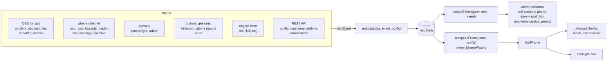

# Architecture

carheadsup is a small event-driven system. Everything the HUD knows arrives as an event; a pure
reducer turns events into state; a pure composer turns state into a frame that says exactly what
to draw; a browser page draws it. This document explains the pieces and the rules that hold them
together. The type definitions in [`packages/core/src/types`](../packages/core/src/types) are the
contract between all of them.

- [Packages](#packages)
- [Data flow](#data-flow)
- [Purity and replayability](#purity-and-replayability)
- [Staleness safety](#staleness-safety)
- [Driving contexts and adaptive clutter](#driving-contexts-and-adaptive-clutter)
- [Alerts](#alerts)
- [Driver input](#driver-input)
- [The server](#the-server)
- [Persistence](#persistence)
- [Security model](#security-model)
- [Performance](#performance)

## Packages

| Package | Role | Key modules |
| --- | --- | --- |
| `@carheadsup/core` | All domain logic and the shared types. No I/O, no clock, no randomness; runs in Node.js and the browser. | `state/reducer.ts`, `compose/compose.ts`, `alerts/`, `display/` (context, brightness, sun, shift light), `vehicle/` (fuel, gear), `trip/`, `maintenance/`, `obd/` (PIDs, formulas, DTC database), `config/` (defaults, presets, schema), `protocol/validate.ts` |
| `@carheadsup/obd` | Talks to the car. | `transport.ts` (serial, TCP), `elm327.ts` (driver), `poller.ts` (PID scheduling), `service.ts` (connect / reconnect loop, events), `sim/` (ELM327 emulator and vehicle simulator) |
| `@carheadsup/hud-server` | The on-car service that wires everything together. | `app.ts` (composition), `engine.ts` (reducer loop, effects, frame timer), `http/` (REST API, static files, auth), `ws/` (phone and renderer sockets), `sensors/` (light, gesture, GPIO buttons, ADAS UDP), `outputs/backlight.ts`, `store/` (config, state, trips), `discovery/mdns.ts`, `sim/` |
| `@carheadsup/hud-renderer` | The three web pages. | `hud/` (projected HUD), `settings/` (settings app), `dev/` (developer console), `common/` (WebSocket feed, REST client, staleness) |
| `companion-android` | The phone app. `:protocol` mirrors the TypeScript contract in Kotlin; `:app` is the Android UI and services. | see [its README](../companion-android/README.md) |

Dependencies point one way: `core` ← `obd` ← `hud-server`, and `core` ← `hud-renderer`. The
renderer never talks to `obd` or the server's internals — only to the server's WebSocket and REST
API.

## Data flow

1. **Inputs become events.** The OBD service emits one `obd/samples` event per polling cycle with
   all values in canonical units (km/h, °C, kPa, V, L/h …). The phone channel validates each
   message and translates it (`phone/translate.ts`). Sensors, buttons and the ADAS feed emit their
   own events; the engine emits a `tick` every 100 ms; config changes arrive as a `config` event.
2. **The engine stamps and reduces.** `HudEngine.dispatch` replaces `event.at` with the engine
   clock — never earlier than the previous event, because the clock of a Pi without a real-time
   clock can step backwards when NTP arrives — and runs `reduce(state, event, config)`.
   Events dispatched while an effect is being handled are queued and processed in order.
3. **Effects.** `deriveEffects(prev, next, event, config)` decides what should happen outside the
   core: tell the phone to accept or decline a call, save and push a finished trip, push due
   maintenance items, persist the state. The server performs them; the core never does I/O.
4. **Frames.** On its own timer (`server.frameRate`, 15 fps by default) the engine runs
   `composeFrame(state, config)` and publishes the `HudFrame`: visible widgets with their zones,
   alerts, toast, call card, shift light, blind-spot and collision state, the parked dashboard and
   the theme (night, brightness), all converted to the driver's units and rounded. The renderer
   does no business logic and no unit conversion; it draws the frame.

The frame is composed per timer tick rather than per event, so a burst of OBD samples costs one
frame, and the frame rate is independent of how often the car answers.

## Purity and replayability

`packages/core` follows strict rules (see [CLAUDE.md](../CLAUDE.md)):

- no `Date.now()`, `Math.random()`, timers, network, filesystem or `console`;
- time comes only from event timestamps (`event.at`, copied to `state.now`);
- state is plain JSON-serialisable data, and functions return new objects.

Same events in, same frames out. Tests use this to replay whole drives:
[`packages/core/test/scenarios/drive.test.ts`](../packages/core/test/scenarios/drive.test.ts)
replays one continuous drive — cold start, city with navigation, highway, speeding, an
overheating engine, a call at a stop, parking, the dashboard, the finished trip — through the
real reducer, effects and composer and checks the frames and effects along the way, and
`random-events.test.ts` feeds long seeded random event streams to the reducer and checks that it
never throws or mutates its input and that every frame is well-formed. The simulator exercises
the same code paths as a real car: it sits behind an emulated ELM327 adapter and a simulated
phone that sends real protocol messages.

## Staleness safety

**A missing value is better than a frozen one.** Every signal sample carries the time it was
received, and every consumer reads it through `freshValue()` (`core/src/staleness.ts`) or the
selectors built on it. Samples older than their limit count as absent: the widget disappears,
the alert rule stops firing, the fuel and trip integrators stop integrating.

| Signal(s) | Stale after |
| --- | --- |
| `speed`, `rpm`, `throttle`, `relativeThrottle`, `acceleratorPedal` | 2 s |
| `engineLoad`, `maf`, `map`, `fuelRate`, `transmissionGear` | 3 s |
| `batteryVoltage`, `controlModuleVoltage` | 15 s |
| `fuelLevel`, `odometer`, `ambientTemp`, tyre pressures | 120 s |
| everything else (temperatures, trims, pressures …) | 10 s |

Other data has its own lifetime:

| Data | Rule |
| --- | --- |
| The whole HUD | The kiosk page blanks everything but a small "no signal" dot when no frame has arrived for 1 s or the socket is closed (`hud-renderer/src/common/staleness.ts`). |
| Blind-spot and collision state | Ignored 1 s after the module's last report; the module counts as disconnected after 2 s of silence. |
| Light-sensor reading | Stops driving the brightness after 5 s; the sun position (or the last level) takes over. |
| Speed limit | Shown only while the phone is connected. |
| Route, road, hazards, media, call | Kept for 30 s after the phone disconnects (a Wi-Fi hiccup should not wipe the route), then dropped. |
| Hazards | Dropped when the phone has not refreshed them for 2 minutes, or once dead reckoning puts them 50 m behind the car. |
| Messages | Forgotten 60 s after receipt. |
| Gear | Hidden as soon as neither rpm + speed nor a reported gear is fresh. |

Navigation and hazard distances are dead-reckoned between phone updates using the distance the
car itself has travelled (integrated from the OBD speed), so the countdown stays smooth even if
the phone reports only once a second.

## Driving contexts and adaptive clutter

The reducer derives one of four contexts from speed, engine state and link state
(`core/src/display/context.ts`), with hysteresis so the layout does not flicker:

| Context | When (defaults from `display.context`) |
| --- | --- |
| `parked` | Standing still with the engine off for 30 s (`engineOffParkedAfterMs`; delayed so automatic start-stop does not open the dashboard at red lights), standing completely still with the engine running for 2 min (`parkedAfterMs`), or no vehicle data at all with the engine off / link down (ignition off: immediately). Sticky until the car actually moves. |
| `stopped` | Below 2 km/h (`stationaryKph`) but not yet parked; left again only above `stationaryKph` + 2 km/h. |
| `highway` | At least 80 km/h (`highwayEnterKph`) for 10 s (`highwayDwellMs`); left below 65 km/h (`highwayExitKph`). |
| `city` | Moving otherwise. |

Two safety exceptions: a car known to be moving is never `parked` (hybrids drive with the engine
off), and losing vehicle data while moving holds the moving context for 30 s so a momentary
adapter drop does not throw the full-screen dashboard up at speed.

**Adaptive clutter** has three layers:

1. The layout (a preset or a custom layout, see [configuration](configuration.md#layouts)) lists
   the widgets, their zone on a 3×3 grid and the contexts in which each may appear.
2. Each widget is shown only when it is relevant and backed by fresh data: coolant and voltage
   only when out of range, tyre pressures while moving only when one is low, navigation on the
   highway only within 2 km of the next maneuver (`highwayNavRevealM`), lanes within 800 m
   (`laneRevealM`), hazards within 1 km (`hazardRevealM`), the speed limit only while the phone
   is connected, media only while something plays.
3. The renderer gives each zone limited room; when widgets do not fit, earlier entries in the
   layout win (the array order is priority order).

When parked, the frame also carries the diagnostics dashboard — pages *overview*, *engine*,
*fuel*, *electrical* (each only with live data), *trouble codes*, *trip* and *maintenance* —
which the renderer shows full screen. The `next-page` / `prev-page` inputs flip through it.

## Alerts

Alerts are evaluated after every event by the rules in `core/src/alerts/rules.ts`. Each alert has
a stable key (e.g. `check-engine:P0420`), a severity (`info` < `caution` < `warning` <
`critical`), a short title (at most 24 characters) and a detail line.

| Kind | Raised when | Severity |
| --- | --- | --- |
| `forward-collision` | The ADAS module reports a collision risk (fresh reading). | `caution` "VEHICLE AHEAD", `critical` "BRAKE!" |
| `coolant` | Coolant ≥ `coolantHighC` (110 °C); cleared `coolantHysteresisC` below. | `warning` "ENGINE HOT", `critical` "OVERHEATING – STOP" at ≥ `coolantCriticalC` (118 °C) |
| `voltage` | Engine running and ≤ `voltageLowRunningV` for 60 s; engine off and ≤ `voltageLowOffV` for 10 s; ≥ `voltageHighV` for 10 s. | `warning` "CHARGING FAULT", `caution` "BATTERY LOW", `warning` "OVERVOLTAGE" |
| `check-engine` | One alert per trouble code. | From the DTC database for stored and permanent codes; `info` while a code is only pending |
| `tpms` | A tyre (when `vehicle.hasTpms`) below `tpmsLowKpa`; cleared 7 kPa above. | `warning` |
| `fuel-low` | Fuel level ≤ `fuelLowPct`; cleared 2 points above. | `caution` |
| `ice-risk` | Outside temperature ≤ `iceRiskC`; shown for 10 s, re-armed after it warms up by 2 °C. | `caution` |
| `maintenance-due` | A service item is due soon / overdue. | `info` / `caution` |
| `obd-link` | No vehicle data for 10 s after having had some. | `info` |

What the driver sees is decided by `selectDisplayedAlerts` (`core/src/alerts/visibility.ts`):

- live alerts only (not dismissed, not scheduled for later, not expired);
- **while moving** (`city`, `highway`), maintenance and OBD-link notices wait until the car
  stops, and check-engine alerts below `warning` are hidden unless `alerts.showDtcWhileDriving`
  is on;
- most severe first, then most recent, capped at `display.maxAlerts` (2);
- while the driver has blanked the HUD, only `critical` alerts (and the collision warning)
  break through.

`primary` acknowledges and `secondary` dismisses the top dismissible alert. **Critical alerts
cannot be dismissed**, and a dismissed alert comes back if its severity escalates.

## Driver input

All controls map to the same seven actions (`InputAction` in `core/src/types/events.ts`):

| Action | Meaning | Gesture | GPIO button | Kiosk keyboard |
| --- | --- | --- | --- | --- |
| `primary` | Accept the ringing call; otherwise acknowledge the top alert | swipe right | primary (short press) | Enter, Space |
| `secondary` | Decline or hang up the call; otherwise dismiss the toast, else the top alert | swipe left | secondary | Escape, Backspace |
| `next-page` / `prev-page` | Flip the parked dashboard | — | next | → / ← |
| `toggle-blank` | Blank / unblank the HUD | — | hold primary ≥ 0.8 s | B |
| `brightness-up` / `brightness-down` | Trim the brightness by ±0.1 (up to ±0.5) | swipe up / down | — | + / − |

The companion app's remote screen sends the same actions over the phone socket (or
`POST /api/input` when the socket is down), and the developer console has buttons for all of
them.

## The server

`createHudServer` (`hud-server/src/app.ts`) composes the service:

1. Load the config (`--config`, default `<data dir>/config.json`), the persisted state and the
   trip log from the data directory. The config parser is lenient: an invalid field falls back to
   its default and is logged; a broken file never stops the HUD from starting.
2. Apply runtime overrides that are never saved: `--sim` switches the OBD transport to the
   simulator (and adds its tyre-pressure PIDs), `--port` / `--host` override `server.port` /
   `server.host`.
3. Build the engine, the OBD link, the sensor sources (light, gesture, GPIO buttons, ADAS UDP —
   each idles quietly when its hardware is absent or disabled), the frame sinks (backlight), the
   phone and renderer channels, and the HTTP server; listen; start everything; advertise over
   mDNS.
4. On `SIGINT` / `SIGTERM`, stop in reverse order (each step limited to 5 s), writing the
   persisted state and flushing the trip log.

A config change through the API is validated, saved atomically and pushed to every component
without a restart: the engine, the OBD service (reconnects if the link settings changed), the
sensor sources (only those whose settings changed restart), the renderer (`display` message), the
phone channel (disconnects a phone whose pairing token no longer matches) and mDNS. Only a new
`server.port` or `server.host` needs a restart.

Failures stay local: the OBD service reconnects with a back-off that doubles up to 30 s; the
`gpiomon` and `avahi-publish-service` helpers are supervised and restarted; an I²C sensor that
fails is re-initialised every 10 s; a sink or source that throws is logged and skipped.

## Persistence

The data directory (`/var/lib/carheadsup` on the Pi, `~/.local/share/carheadsup` by default,
`…/sim` with `--sim`) holds:

| File | Contents | Written |
| --- | --- | --- |
| `config.json` | The configuration (unless `--config` points elsewhere). Pretty-printed and hand-editable; if the server has to correct it on load, the original is kept as `config.json.bak`. | On every change from the API |
| `state.json` | Odometer, learned gear ratios, long-run average consumption, service records. | Coalesced 2 s after a change; the odometer at most once a minute while driving; on shutdown |
| `trips.jsonl` | One completed trip per line, oldest first; at most 5,000 trips (the oldest are dropped). | Appended when a trip ends |

The Pi loses power whenever the ignition goes off, so every write is crash-safe: whole files are
written to a temporary file, `fsync`ed and renamed over the original, then the directory is
`fsync`ed; trip appends are `fsync`ed and a torn last line is ignored on load. Files are created
with mode `0600` and directories with `0700`: they hold the tokens and your driving history.

## Security model

The HUD runs on the car's own Wi-Fi, usually as the access point for one phone. The protections:

- **Loopback is trusted.** Requests from the Pi itself (the kiosk browser, local tools) are always
  allowed.
- **API token.** When `server.apiToken` is set, every other client must send
  `Authorization: Bearer <token>` to use `/api/*`, and remote renderer clients (`/ws/hud`) must
  pass it as a Bearer header or `?token=`. With no token, anyone on the car's network can use the
  API — set one unless the Wi-Fi is yours alone. Changing the token disconnects remote clients
  that no longer match.
- **Pairing token.** The phone socket (`/ws/phone`) is authenticated by its first message:
  `hello.token` must equal `phone.pairingToken` when one is set. Tokens are compared in constant
  time (both sides hashed with SHA-256 first).
- **Cross-site protection.** State-changing API requests and all WebSocket upgrades are refused
  when a browser says they come from another site (`Origin` / `Sec-Fetch-Site`), so a web page
  visited on the phone cannot drive the HUD's API.
- **Hardened responses.** A strict Content Security Policy, `X-Frame-Options: DENY`,
  `nosniff`, no referrer; static files are served read-only with path-traversal checks; the web
  pages themselves contain no secrets and are served without authentication.
- **Input limits.** JSON bodies ≤ 256 KiB; phone messages ≤ 128 Ki characters, validated
  strictly (length-capped strings, no control characters, finite in-range numbers, known enum
  values); the phone socket is rate limited to 50 messages/s (burst 100); the ADAS feed to
  50 datagrams/s of at most 4 KiB. Details in [protocol.md](protocol.md).
- **No message content.** The `message` type has no content field and a message carrying
  anything that looks like content (`body`, `text`, `snippet` …) is rejected.
- **Least privilege on the Pi.** The service runs as the unprivileged `carheadsup` user with a
  hardened systemd unit; the kiosk browser runs as a separate user; config and data are private
  to the service ([install guide](install-raspberry-pi.md)).

Not covered: the HUD speaks plain HTTP and WebSocket, so tokens cross the Wi-Fi in clear text.
Use WPA2 with a strong passphrase on the hotspot. Anyone with physical access to the Pi (or its
SD card) has everything.

## Performance

- **Frames**: composed on a timer at `server.frameRate` (15 fps) and serialised once for all
  clients; a client whose unsent backlog exceeds 1 MiB skips frames instead of queueing them.
  The kiosk blanks if frames stop for 1 s, so keep `frameRate` at 2 or more.
- **Ticks**: one `tick` event every 100 ms drives fades, staleness, context timers and trip end.
- **OBD polling**: cycles start at most every 100 ms; each cycle asks for the fast PIDs (speed,
  rpm, throttle, pedal, MAF or MAP, fuel rate) — up to six PIDs per request on CAN — plus at most
  two requests for due medium (1 s), slow (5 s) and very slow (10 s) PIDs. How many cycles per
  second you get depends on the adapter and the car; see [obd.md](obd.md#polling).
- **Sensors**: light sensor at 5 Hz, gesture sensor polled every 40 ms, backlight written at most
  10 times a second and only on a change of at least 1 %.
- **Rendering**: the page is Preact with a single CSS `matrix3d()` transform for mirroring,
  rotation and keystone correction, which the browser composites on the GPU.
- **Disk**: persistence is coalesced (see above), so the SD card sees a few small writes per
  minute while driving.
