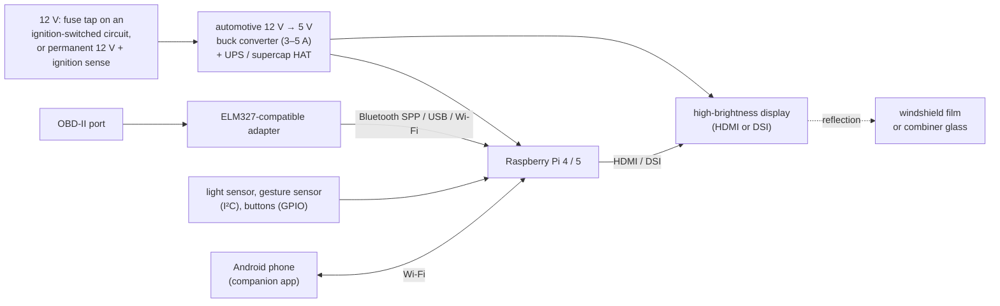

# Hardware

A reference build and the things that matter when you put a Raspberry Pi and a bright screen on a
car's dashboard. Nothing here is required by the software — it runs anywhere Node.js and a browser
run — but the choices below decide whether the HUD is readable at noon and invisible at night,
and whether the car still starts after a week in the garage.

- [Reference build](#reference-build)
- [Computer](#computer)
- [Display](#display)
- [Optics: getting the image onto the glass](#optics-getting-the-image-onto-the-glass)
- [OBD-II adapter](#obd-ii-adapter)
- [Power](#power)
- [Clock](#clock)
- [Sensors, buttons and wiring](#sensors-buttons-and-wiring)
- [Optional ADAS module](#optional-adas-module)
- [Heat and sun](#heat-and-sun)
- [Bill of materials](#bill-of-materials)

## Reference build



- Raspberry Pi 4 (2 GB or more) or Pi 5 running Raspberry Pi OS Lite (64-bit).
- A 5–7" IPS display of at least 1000 cd/m², lying on the dashboard, facing up.
- A reflective HUD film on the windshield above it, or a separate combiner glass.
- An OBDLink or vLinker adapter over Bluetooth (or USB).
- A 12 V → 5 V automotive buck converter behind an ignition-sensing power controller.
- Optional: a light sensor for auto-brightness, an APDS-9960 gesture sensor or three buttons, a
  DS3231 real-time clock.

## Computer

| Board | Verdict |
| --- | --- |
| **Raspberry Pi 4** (2–4 GB) | The reference. Plenty for Node.js plus Chromium at 15 fps, standard HDMI via micro-HDMI, draws roughly 3–6 W. |
| **Raspberry Pi 5** (4 GB) | Faster start-up and rendering, and a built-in real-time clock (with the optional battery). Needs a 5 V / 5 A supply to power USB devices at full current, draws more and runs hotter — plan for its active cooler. |
| **Raspberry Pi Zero 2 W** | Small and cheap, but 512 MB of RAM is tight for Chromium next to Node.js: slow start, less headroom. Workable with a small display; lower `server.frameRate` to 10. Wi-Fi is 2.4 GHz only and the display needs a mini-HDMI adapter. |

Storage: a high-endurance microSD card (sold for dash cams) or a USB SSD, and a
[read-only root file system](install-raspberry-pi.md#read-only-root-file-system) — power is cut
every time you switch the car off.

## Display

What you see is the display reflected by the glass. Glass reflects only a small fraction of the
light (roughly 5–15 % at windshield angles, more with a reflective film), and on a sunny day the
background behind that reflection is the sky. Hence:

- **Brightness: 1000 cd/m² (nits) or more.** Ordinary 250–400-nit panels — including the
  official Raspberry Pi touch displays — are fine on the bench and at night but wash out in
  daylight. Look for "high brightness" or "sunlight readable" in the specification.
- **IPS.** You look at the panel at a steep angle via the reflection; TN panels lose contrast and
  shift colour there.
- **Backlight control.** At night the image must be dim, and an LCD's "black" still glows: without
  dimming the backlight you see a faint grey rectangle on the windshield. When Linux exposes the
  panel's backlight (`/sys/class/backlight/*`, typical for DSI panels; see `--backlight`), the
  HUD writes the brightness to it and draws the page at full brightness; otherwise it dims the
  page itself. A backlight device that appears after the HUD started (driver or udev rule late at
  boot) is picked up within 10 s. A panel with a hardware dimmer (PWM input or knob) works too.
- **Size and resolution**: 5–7" suits most dashboards. The layouts are tested at **800×480**,
  **1024×600** and the wide **1280×480** "bar" format (about 8.8"), which gives room for widgets
  left and right of the speed; the developer console also previews 1920×720 (12.3" bars).
- **Interface**: HDMI is the easy path on any Pi; DSI panels connect with a ribbon cable and
  usually expose backlight control. Some bar displays are natively portrait (e.g. 480×1280): leave
  the OS unrotated and set `display.projection.rotation` to 90 or 270 in the settings app.
- **Polarisation.** LCDs emit polarised light and glass reflects the two polarisations very
  differently, so how the panel is turned on the dash changes how bright the reflection is. Try
  the panel in both orientations (or with a half-wave retarder film) before you build the mount.
  Polarised sunglasses can dim or hide a windshield reflection altogether.

## Optics: getting the image onto the glass

The panel lies on the dashboard, screen up, and you see its reflection in the windshield.

- **Mirroring.** A reflection is mirror-inverted, so the HUD flips its output left-to-right by
  default (`display.projection.mirrorX = true`). Depending on how the panel is mounted you may
  also need `mirrorY` or a rotation.
- **Double images.** Plain windshield glass reflects twice — at the inner and the outer surface —
  and you see a ghost image slightly offset. Factory HUDs use a wedge-shaped windshield
  interlayer. For DIY:
  - a **HUD reflective film** (a small transparent patch applied to the inside of the windshield)
    reflects much more light than the glass behind it, which makes the image brighter and the
    ghost faint; or
  - a **combiner glass**: a small tilted, partly reflective plate on the dashboard, in front of
    the windshield. No film on the windshield, but another object in your view.

  Check the rules for your country: some restrict films and objects in the windshield area (see
  [safety.md](safety.md#legal-notes)).
- **Mounting angle and position.** Put the panel low, close to the windshield and centred in
  front of the driver, so the image appears just above the bonnet line without covering the
  road. The windshield's rake decides where the image lands; shims under the panel adjust it. The
  virtual image appears only about as far behind the glass as the panel is in front of it — about
  a metre from your eyes, not several metres down the road like a factory HUD with focusing
  optics — so your eyes refocus between road and HUD. Keep the content glanceable.
- **Glare shield.** A black hood around the panel keeps sunlight off its face (contrast), and at
  night stops it from lighting up the dashboard or reflecting in the side windows.
- **Keystone calibration.** The glass is curved and tilted, so a rectangle comes out as a
  trapezoid. In the settings app, *Projection → Show calibration grid on the HUD* replaces the HUD
  with a grid; drag the four corners in the *Keystone* editor until the grid looks rectangular
  and evenly spaced from the driver's seat, then adjust *Size* and *Move left / right / up /
  down*. Turn the grid off when done.
- **Airbags and crashes.** Never mount anything on or over an airbag lid (the passenger airbag
  often deploys through the dashboard top), and fix the panel so it cannot become a projectile.

## OBD-II adapter

The HUD speaks the ELM327 command set, which almost every OBD-II adapter implements, over a
serial port (Bluetooth SPP or USB) or TCP (Wi-Fi). It supports every OBD-II protocol the adapter
supports (CAN, J1850, ISO 9141, KWP2000). Bluetooth Low Energy is not supported.

| Adapter | Link | Notes |
| --- | --- | --- |
| **OBDLink MX+** | Bluetooth (classic, SPP) | STN chip: fast, robust, low-power sleep. Recommended. |
| **OBDLink LX** | Bluetooth (classic, SPP) | Like the MX+ without the extra manufacturer networks. Recommended. |
| **OBDLink EX / SX** | USB | Wired and fast. |
| **OBDLink CX** | Bluetooth **LE only** | Does not work with carheadsup: it has no SPP serial profile, and the HUD has no BLE transport. |
| **vLinker MC+** | Bluetooth (classic SPP + BLE) | Good value; use it over classic Bluetooth. |
| **vLinker FS** | USB (a Bluetooth version exists too) | Good value, wired. |
| Cheap "ELM327 v1.5 / v2.1" clones | any | Avoid. Most are old firmware copies with a fake version number: slow, missing commands, some cannot carry several PIDs per request. The driver copes with many of their quirks, but you get fewer updates per second and more dropouts. |

How to connect it:

- **Bluetooth (classic)**: pair once with `bluetoothctl`, then bind it to `/dev/rfcomm0` at boot
  with the `obd-rfcomm@<MAC>.service` unit (`obd.transport = "serial"`,
  `obd.serialPath = "/dev/rfcomm0"`, the default). The Pi's built-in Bluetooth works; keep the Pi
  within a couple of metres of the port. See the
  [install guide](install-raspberry-pi.md#6-pair-the-obd-ii-adapter).
- **USB**: plug it in and use its stable name, e.g.
  `obd.serialPath = "/dev/serial/by-id/usb-…"` (list them with `ls /dev/serial/by-id/`). Set
  `obd.baudRate` to the adapter's rate if it is not 38400 (check its manual). The most robust
  option, if you can route a cable.
- **Wi-Fi**: `obd.transport = "tcp"`, usually `192.168.0.10:35000`. The Pi has to join the
  adapter's own access point, which conflicts with the Pi being the phone's access point — you
  would need a second Wi-Fi interface. Not recommended.

Most OBD ports supply permanent battery power (pin 16) even with the ignition off, so an adapter
left plugged in drains the battery slowly. Adapters with a sleep mode (OBDLink) handle this;
otherwise unplug it when parking for weeks. More in [obd.md](obd.md).

## Power

A car's 12 V system is hostile: about 12.4 V with the engine off, 13.8–14.7 V running, dips to
6–9 V while cranking, and spikes when heavy loads switch. And the power must go away when you
leave the car, without corrupting the SD card and without draining the battery.

- **Converter**: an automotive-rated 12 V → 5 V buck converter with a wide input range and
  protection, rated **3 A for a Pi 4, 5 A for a Pi 5**, plus whatever the display draws (many
  HDMI panels take 5 V or 12 V directly; sunlight-readable panels can draw several watts). Do not
  use a cigarette-lighter USB charger that sags under load.
- **Fuse**: take power from the fuse box with an "add-a-fuse" tap and a 3–5 A fuse.
- **Safe shutdown.** Cutting power to a running Pi risks the SD card. Choose one of:
  - **Ignition-sensed power controller** (the robust option): fed from permanent 12 V with an
    ignition-sense wire. When the ignition goes off it signals the Pi on a GPIO, waits until the
    Pi has halted, then cuts power. Configure the signal with the `gpio-shutdown` overlay and,
    if the controller wants to be told that the Pi has halted, `gpio-poweroff` (see
    [config.txt](install-raspberry-pi.md#bootfirmwareconfigtxt)).
  - **UPS or supercapacitor HAT** on an ignition-switched supply: bridges the 10–20 s the Pi needs
    to shut down after it loses input power, and triggers the shutdown itself. Prefer
    supercapacitors: lithium cells do not like a car interior in summer.
  - A **read-only root file system** makes an unclean power cut harmless for the OS; trips and
    settings are written crash-safely anyway ([architecture](architecture.md#persistence)).

  On the stop signal the HUD saves its state — odometer, service records and the trip in
  progress — before anything else, then shuts its parts down (a few seconds; systemd allows it
  30 s). Give the controller or supercap enough time for the whole shutdown. A trip only ends by
  itself after 5 minutes without the engine (`trip.endAfterEngineOffMs`, so a fuel stop does not
  split it), long after such a power-down: the saved trip is closed at the next start (ending at
  its last activity) and then appears in the trip log and on the phone — or continued, if the
  car was off only briefly.
- **Don't drain the battery.** Never power the Pi from permanent 12 V without a controller that
  switches it off: a Pi 4 idling at 2–3 W takes roughly 5 Ah from the battery per day. A halted
  Pi 4 or 5 still draws power unless the bootloader is told to switch off completely on halt
  (`sudo rpi-eeprom-config --edit`, set `POWER_OFF_ON_HALT=1` and `WAKE_ON_GPIO=0`).

## Clock

The Raspberry Pi has no battery-backed clock (the Pi 5 has one, but only with its optional
battery fitted). Without network time it boots with the time it last shut down, and network time
arriving later steps the clock — forwards, or backwards if a real-time clock ran fast. The HUD's
own timing survives both: it measures time on a monotonic clock, so a step mid-drive neither
expires live data nor splits the trip in progress, and the clock widget, trip times, service
dates and night mode follow the corrected time at once
([details](architecture.md#engine-time-and-the-wall-clock)). But those are only as right as the
system time — and without either a real-time clock or network time, the HUD cannot tell how long
the car was off: every restart looks like a short stop, so consecutive drives are merged into one
trip. (When network time arrives later, a trip merged that way is split again.)

- **Network time via the phone**: if the Pi joins the phone's hotspot (instead of being the
  hotspot), `systemd-timesyncd` sets the time at every start. See
  [install guide](install-raspberry-pi.md#8-wi-fi-for-the-phone).
- **DS3231 RTC module** (I²C address `0x68`, shares the bus with the sensors): add
  `dtoverlay=i2c-rtc,ds3231` to `/boot/firmware/config.txt`, then follow the module's
  Raspberry Pi guide for the remaining OS steps — reading the clock at boot and setting it once
  from network time — which differ between OS releases. `timedatectl` shows whether the system
  sees the RTC.
- **Pi 5 with the RTC battery**: works out of the box. For the official rechargeable battery,
  enable charging with `dtparam=rtc_bbat_vchg=3000000` (never with a non-rechargeable cell).

Set the time zone too (`sudo raspi-config` → *Localisation Options*), since the HUD shows local
time.

## Sensors, buttons and wiring

All optional; enable each in the settings app (*Sensors and buttons*) or in `config.json`.

### Enabling I²C

```sh
sudo raspi-config nonint do_i2c 0     # or add dtparam=i2c_arm=on to /boot/firmware/config.txt
sudo apt install -y i2c-tools
i2cdetect -y 1                        # after wiring: shows the sensors' addresses
```

### Light sensor (auto-brightness and night mode)

Supported: **BH1750** (`0x23`, or `0x5C` with ADDR high), **VEML7700** (`0x10`), **TSL2591**
(`0x29`). Set `sensors.lightSensor` to the chip. Mount it **facing forward and up**, looking
through the windshield at the sky ahead — that is the brightness your eyes adapt to — not shaded
by the glare shield, not seeing the HUD's own light, and not facing the sun through a side
window. If it sits behind tinted glass or a cover, raise `sensors.lightSensorGain` (the factor the
readings are multiplied by) until the automatic brightness matches what you need by day and by
night; the brightness curve itself is in [configuration.md](configuration.md#displaybrightness).
Without a sensor the HUD falls back to the sun's elevation, computed from the phone's GPS or
`sensors.fallbackLocation`.

### Gesture sensor

An **APDS-9960** breakout (`0x39`) on the same I²C bus (`sensors.gestureSensor = "apds9960"`).
Swipe your hand over it about 5–10 cm away: **right = accept / OK, left = decline / dismiss,
up / down = brighter / dimmer** — directions relative to the markings on the board, so mount it
the right way round, somewhere a hand passes naturally (dashboard edge, centre console). The INT
pin is not needed; the sensor is polled.

### Buttons

Up to three momentary push buttons, each between a GPIO pin and ground; the HUD enables the
internal pull-up and reads them with libgpiod's `gpiomon` (`sudo apt install gpiod`). Numbers are
**BCM GPIO numbers**, not header pin numbers.

| Role | Config | Press | Hold ≥ 0.8 s | Example GPIO (header pin) |
| --- | --- | --- | --- | --- |
| Accept / OK | `sensors.buttons.primary` | accept call, acknowledge alert | blank / unblank the HUD | GPIO 17 (pin 11) |
| Decline / dismiss | `sensors.buttons.secondary` | decline / hang up, dismiss toast or alert | — | GPIO 27 (pin 13) |
| Next page | `sensors.buttons.next` | next dashboard page; at a stop, open the dashboard | — | GPIO 22 (pin 15) |

Ground: pin 9 or 14. On long cables add an external 10 kΩ pull-up to 3.3 V and a 100 nF capacitor
to ground at the Pi; with an old `gpiomon` that cannot set pull-ups, the log tells you so and
`gpio=17,27,22=ip,pu` in `config.txt` sets them at boot.

### Pin summary

| Function | GPIO | Header pin |
| --- | --- | --- |
| 3.3 V for sensors | — | 1 |
| I²C SDA / SCL (light, gesture, RTC) | 2 / 3 | 3 / 5 |
| Ground | — | 6, 9, 14, 20, 25, 30, 34, 39 |
| Buttons (example) | 17, 27, 22 | 11, 13, 15 |
| Shutdown request from the power controller (example) | 26 | 37 |
| "Halted" signal to the power controller (example) | 16 | 36 |

GPIO 3 is also I²C SCL: the classic "button on GPIO 3" shutdown trick collides with the sensors,
so use another pin for `gpio-shutdown` when I²C is in use. Keep I²C wires short (well under a
metre) or use a bus extender.

## Optional ADAS module

The HUD can show blind-spot indicators and a forward-collision warning, but it detects nothing
itself: an external module (a radar or camera system of your own, an ESP32 with radar sensors …)
decides and sends the result as **newline-delimited JSON over UDP** to the HUD's address, port
`sensors.adasUdpPort` (e.g. 5005).

```json
{"t":"blind-spot","left":true,"right":false}
{"t":"collision","level":"warning","ttcSeconds":1.4}
{"t":"heartbeat"}
```

- `level` is `none`, `caution` ("VEHICLE AHEAD") or `warning` ("BRAKE!", critical, not
  dismissible); `ttcSeconds` (time to collision) is optional.
- A reading counts for **1 s**: repeat active states at 5–10 Hz. The module counts as
  disconnected after **2 s** without a valid message — send a heartbeat at least once a second
  when there is nothing to report.
- Up to 8 messages per datagram, datagrams up to 4 KiB, at most 50 datagrams per second (each
  sender has its own budget).
- Give the module a static IPv4 address and list it in `sensors.adasAllowedSenders` (settings
  app: *Sensors and buttons → Driver-assist module → Accept data only from*). The HUD then
  ignores datagrams from every other address, so a passenger's phone on the same Wi-Fi can
  neither raise nor hide a warning. With the list empty it accepts **any** device that can reach
  the port, and logs a warning saying so. The check is by address, which a device on the same
  network can forge: if that matters, put the module on a link of its own
  ([more](protocol.md#adas-udp-feed)).

Quick tests from any Linux machine on the car's network (`10.42.0.1` is the HUD on its own
hotspot; list that machine's address in `sensors.adasAllowedSenders` too, or it is ignored):

```sh
echo '{"t":"blind-spot","left":true,"right":false}' > /dev/udp/10.42.0.1/5005   # bash
```

```python
import json, socket, time
sock = socket.socket(socket.AF_INET, socket.SOCK_DGRAM)
for _ in range(50):  # 5 s of "car in the left blind spot"
    sock.sendto((json.dumps({"t": "blind-spot", "left": True, "right": False}) + "\n").encode(),
                ("10.42.0.1", 5005))
    time.sleep(0.1)
```

The full message reference is in [protocol.md](protocol.md#adas-udp-feed).

## Heat and sun

A dashboard in the sun easily reaches 70–100 °C.

- **Displays**: many LCDs turn temporarily black above their clearing temperature and can be
  damaged by long exposure; check the operating and storage temperature ratings. Sunlight falling
  onto the panel through the windshield heats it further — cover it (or fold the glare shield
  over it) when parked in the sun.
- **The Pi** throttles at about 80–85 °C. Use a case with a heat sink, keep it out of direct sun
  (under the dashboard rather than on it) and give it some airflow; the Pi 5 needs its cooler.
- **Batteries**: lithium cells in a hot car age fast and can fail dangerously; prefer supercapacitor
  UPS boards.
- **SD cards and adhesives**: use parts rated for the temperature, and mechanical fixings rather
  than double-sided tape, which lets go in the heat.
- **Condensation** in winter: let the electronics warm up before relying on them.

## Bill of materials

Rough 2025–2026 street prices in US dollars; they vary a lot by region and shop.

| Part | Example | Approx. price |
| --- | --- | --- |
| Computer | Raspberry Pi 4 (2 GB) / Pi 5 (4 GB) | $45 / $60 |
| Storage | 32 GB high-endurance microSD | $12 |
| Cooling and case | aluminium heat-sink case / Pi 5 active cooler | $10–20 |
| Display | 5–7" IPS, ≥ 1000 nits, HDMI or DSI (or a 1280×480 bar display) | $70–150 |
| Optics | HUD reflective film or combiner glass | $10–25 |
| Power | automotive 12 → 5 V buck converter, 5 A | $10–20 |
| Safe shutdown | ignition-sensing power controller or supercap UPS HAT | $30–70 |
| Wiring | fuse tap, fuses, cables, connectors | $10–15 |
| OBD-II adapter | OBDLink LX / MX+, or vLinker MC+ / FS | $30–140 |
| Light sensor (optional) | BH1750 / VEML7700 / TSL2591 breakout | $3–10 |
| Gesture sensor (optional) | APDS-9960 breakout | $5–10 |
| Buttons (optional) | 3 momentary push buttons | $5 |
| Real-time clock (optional) | DS3231 module (not needed on a Pi 5 with its battery) | $5 |
| **Total** | | **about $200–450** |
